# Sơ Đồ Tương Tác Agent — Web Server — Frontend

> Tài liệu mô tả toàn diện cơ chế giao tiếp giữa **FlowBuilder Agent** (Golang), **Backend Gateway** (Spring Boot), **Frontend Web UI** (Angular 21), **Worker Pool** và các hệ thống phụ trợ.

---

## 1. Kiến Trúc Tổng Thể (High-Level Architecture)

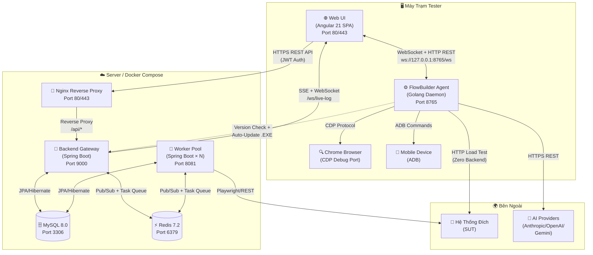

---

## 2. Mô Hình Tam Giác — Triangular Topology

> **Nguyên tắc thiết kế cốt lõi**: Backend Gateway **KHÔNG** kết nối trực tiếp tới Agent. Web UI đóng vai trò **nhạc trưởng (Orchestrator)** kết nối đồng thời tới cả Backend và Agent.

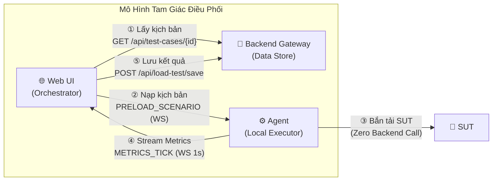

### Giải thích chiều dữ liệu:

| Bước | Chiều | Giao thức | Mô tả |
|:---:|:---|:---|:---|
| ① | Web UI → Backend | HTTP REST (JWT) | Lấy kịch bản test, metadata, dataset từ CSDL |
| ② | Web UI → Agent | WebSocket / HTTP | Nạp trọn bộ kịch bản + CSV vào RAM Agent |
| ③ | Agent → SUT | HTTP/1.1 & HTTP/2 | Sinh tải cực hạn, **không gọi về Backend** |
| ④ | Agent → Web UI | WebSocket | Stream telemetry RPS, Latency p50/90/95/99 mỗi 1s |
| ⑤ | Web UI → Backend | HTTP REST (JWT) | Chuyển tiếp FINAL_REPORT để lưu trữ vào MySQL |

---

## 3. Giao Thức & Cổng Kết Nối Chi Tiết

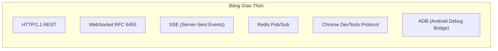

| Kết nối | Cổng | Giao thức | Xác thực | Mô tả |
|:---|:---:|:---|:---|:---|
| Web UI ↔ Agent | `8765` | HTTP REST + WebSocket | Token `flowbuilder-agent-secret` | Điều khiển local, chỉ bind `127.0.0.1` |
| Web UI → Nginx | `80/443` | HTTPS REST | — | Static SPA + Reverse Proxy |
| Nginx → Gateway | `9000` | HTTP REST | Forward headers | Proxy `/api/*` requests |
| Web UI ↔ Gateway | `9000` | REST + SSE + WebSocket | JWT Bearer Token | API chính, live-log streaming |
| Gateway ↔ Redis | `6379` | Redis Protocol | Password auth | Pub/Sub event bus + Task Queue |
| Gateway ↔ MySQL | `3306` | JDBC/MySQL | Username/Password | Persistent storage |
| Worker ↔ Redis | `6379` | Redis Protocol | Password auth | Nhận task, publish kết quả |
| Worker ↔ MySQL | `3306` | JDBC/MySQL | Username/Password | Đọc/ghi kết quả test |
| Agent → Chrome | Dynamic | CDP (HTTP + WS) | — | Ghi/phát kịch bản web |
| Agent → Mobile | USB/TCP | ADB Protocol | — | Automation thiết bị Android |
| Agent → AI | `443` | HTTPS REST | API Key | Gọi LLM providers |
| Agent → Gateway | `9000` | HTTP REST | Public (permitAll) | Chỉ kiểm tra version & tải .EXE |

---

## 4. Luồng Tương Tác WebSocket Agent (Chi tiết)

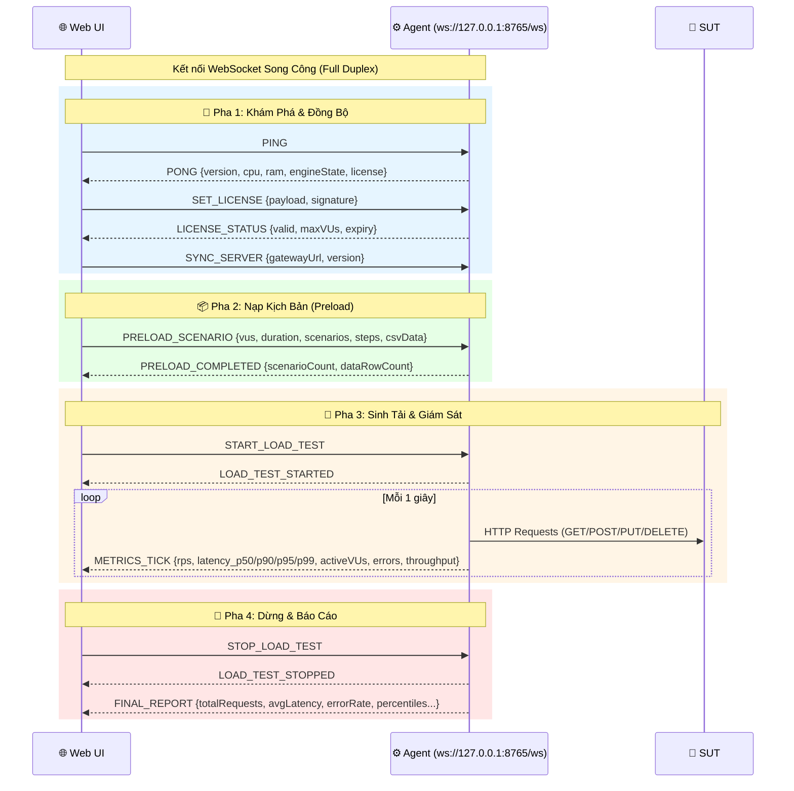

---

## 5. Luồng Tương Tác Web Recording (CDP)

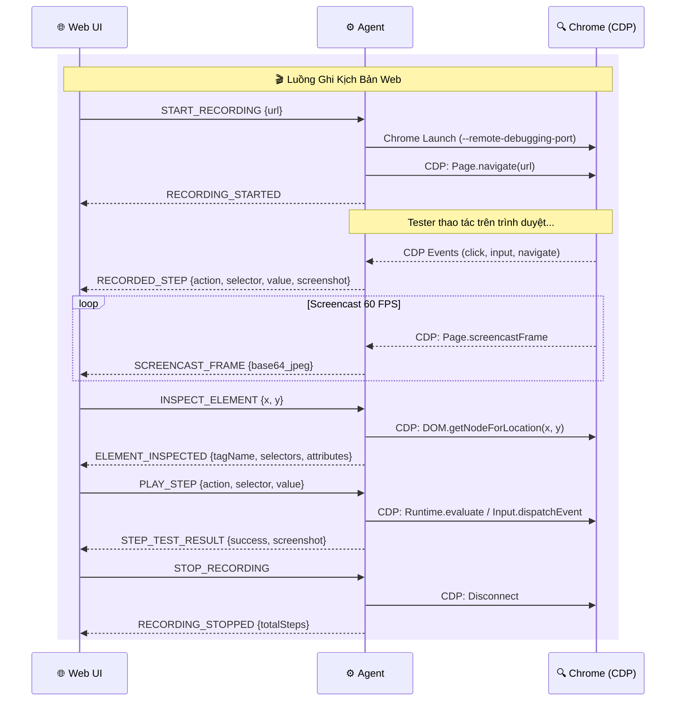

---

## 6. Luồng Gateway — Worker Pool (Redis Pub/Sub)

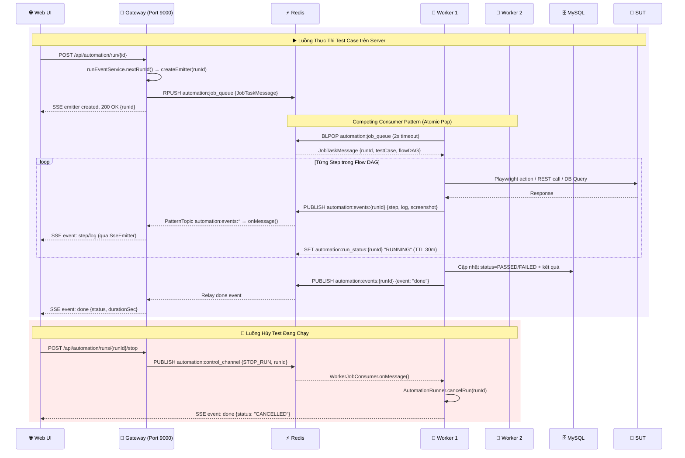

### 6.1. Worker Grid Heartbeat & Discovery

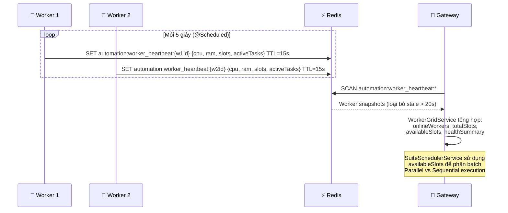

### 6.2. Bảng Redis Keys & Channels

| Redis Key / Channel | Loại | TTL | Mục đích |
|:---|:---|:---:|:---|
| `automation:job_queue` | List (RPUSH/BLPOP) | — | Hàng đợi task Competing Consumer |
| `automation:events:{runId}` | Pub/Sub Channel | — | Stream sự kiện step/log/done từ Worker → Gateway |
| `automation:control_channel` | Pub/Sub Channel | — | Broadcast lệnh STOP_RUN tới tất cả Workers |
| `automation:run_status:{runId}` | String (SET) | 30m | Cache trạng thái run (RUNNING/PASSED/FAILED) |
| `automation:worker_heartbeat:{workerId}` | String (SET) | 15s | Heartbeat CPU, RAM, slots từ Worker |
| `automation:license_channel` | Pub/Sub Channel | — | Đồng bộ license mới tới toàn cluster |
| `system:events:browser_engine_reload` | Pub/Sub Channel | — | Hot-reload browser engine (Chromium ↔ Obscura) |

### 6.3. SSE Stream — Frontend Nhận Kết Quả Thời Gian Thực

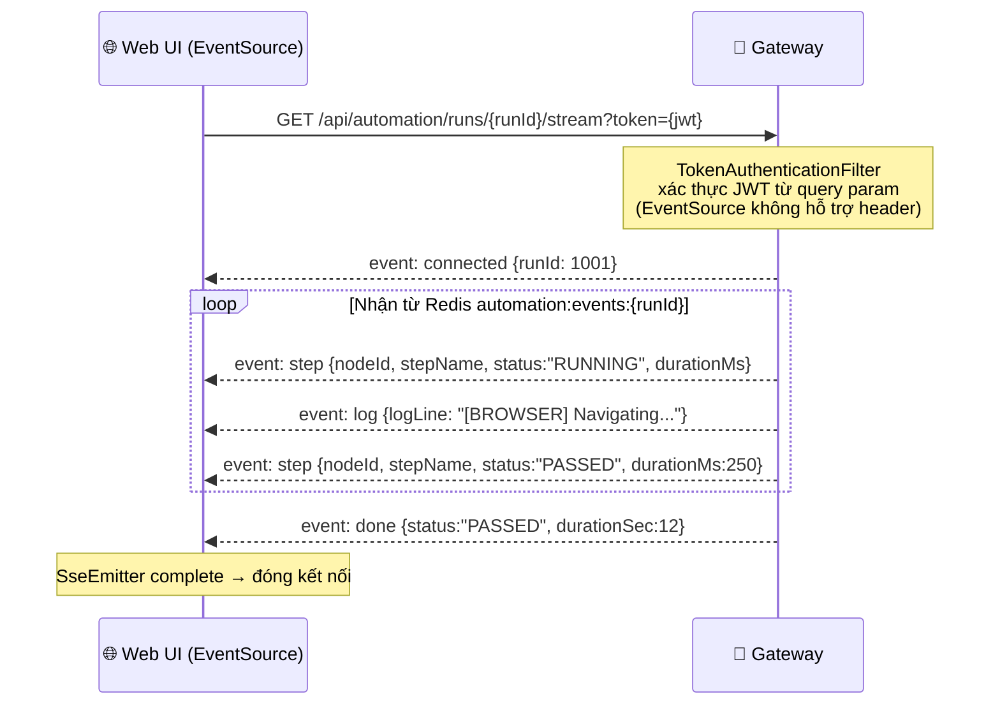

---

## 7. Luồng Auto-Update Agent

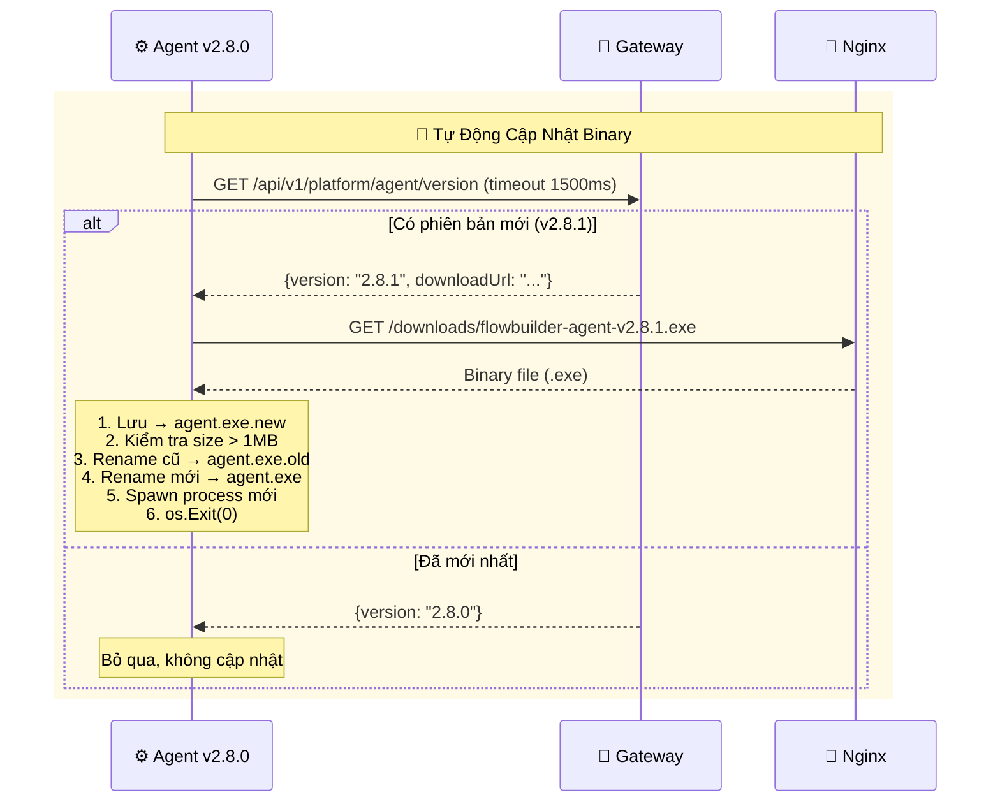

---

## 8. Luồng Xác Thực License (Offline RSA-2048)

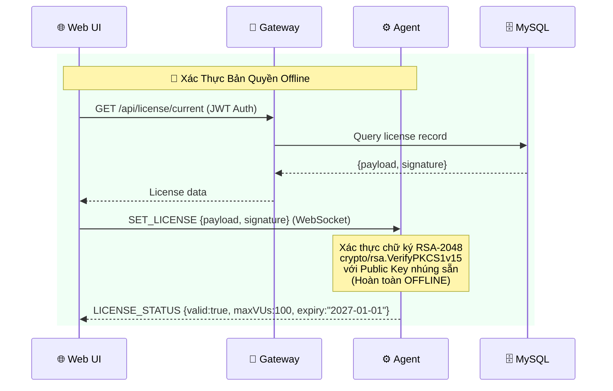

---

## 9. Luồng Mobile Automation

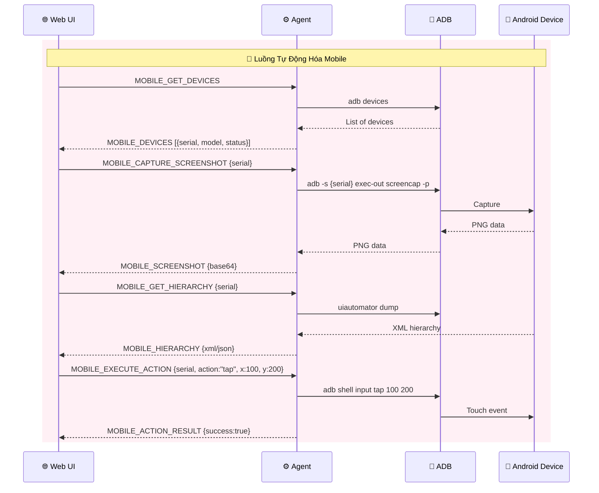

---

## 10. Bảng Tổng Hợp Tất Cả API Endpoints Của Agent

### 10.1. Hệ Thống & Bản Quyền

| Method | Endpoint | Mô tả |
|:---|:---|:---|
| `GET` | `/health` | Health check + Agent discovery (version, CPU, RAM, license) |
| `GET` | `/api/license` | Lấy trạng thái license hiện tại |
| `POST` | `/api/license` | Nạp và xác thực license RSA-2048 |
| `POST` | `/api/sync-server` | Đồng bộ thông tin Backend Gateway (auto-update) |

### 10.2. Load Test

| Method | Endpoint | Mô tả |
|:---|:---|:---|
| `POST` | `/api/preload` | Nạp kịch bản + dataset CSV vào RAM |
| `POST` | `/api/start` | Khởi động sinh tải |
| `POST` | `/api/stop` | Dừng khẩn cấp |

### 10.3. Smart API Testing

| Method | Endpoint | Mô tả |
|:---|:---|:---|
| `POST` | `/api/policy/ping` | Kiểm tra thông tuyến mạng/firewall |
| `POST` | `/api/testcases/batch-run` | Chạy batch test cases API |
| `POST` | `/api/http/execute` | Thực thi 1 HTTP request (bypass CORS) |

### 10.4. Chrome CDP Web Recording

| Method | Endpoint | Mô tả |
|:---|:---|:---|
| `GET` | `/api/chrome/launch` | Mở Chrome với CDP debug port |
| `GET` | `/api/chrome/shortcut` | Tạo desktop shortcut |
| `GET` | `/api/chrome/close` | Đóng Chrome |
| `GET` | `/api/record/start` | Bắt đầu ghi kịch bản |
| `GET` | `/api/record/stop` | Dừng ghi |
| `GET` | `/api/record/status` | Kiểm tra trạng thái ghi |
| `POST` | `/api/record/inspect-mode` | Bật/tắt inspect element |
| `POST` | `/api/record/inspect` | Lấy thông tin DOM element tại (x, y) |
| `POST` | `/api/record/highlight` | Highlight element trên trang |
| `POST` | `/api/record/clear-highlight` | Xóa highlight |
| `POST` | `/api/record/navigate` | Điều hướng URL |
| `GET` | `/api/record/back` | Quay lại trang trước |
| `GET` | `/api/record/forward` | Trang tiếp theo |
| `GET` | `/api/record/reload` | Tải lại trang |
| `POST` | `/api/record/click` | Click tại tọa độ (x, y) |
| `POST` | `/api/record/text` | Gõ văn bản |
| `POST` | `/api/record/key` | Gửi phím bấm (Enter, Tab...) |
| `GET` | `/api/record/screenshot` | Chụp ảnh màn hình trang |
| `POST` | `/api/record/play-step` | Chạy thử 1 bước test |

### 10.5. AI & LLM

| Method | Endpoint | Mô tả |
|:---|:---|:---|
| `GET` | `/api/ai/claude-settings` | Quét cấu hình Claude local |
| `POST` | `/api/ai/generate-flow` | Sinh test flow bằng AI (proxy tới LLM) |
| `POST` | `/api/ai/spec-heal` | Chữa lành kịch bản từ đặc tả BA |

### 10.6. Proxy Config

| Method | Endpoint | Mô tả |
|:---|:---|:---|
| `GET` | `/api/config/proxy` | Lấy cấu hình proxy hiện tại |
| `POST` | `/api/config/proxy` | Lưu cấu hình proxy |
| `POST` | `/api/config/proxy/test` | Test kết nối qua proxy |

### 10.7. Mobile Automation

| Method | Endpoint | Mô tả |
|:---|:---|:---|
| `GET` | `/api/mobile/status` | Trạng thái ADB |
| `GET` | `/api/mobile/devices` | Danh sách thiết bị kết nối |
| `GET` | `/api/mobile/current-app` | App đang chạy foreground |
| `GET` | `/api/mobile/packages` | Danh sách ứng dụng đã cài |
| `GET` | `/api/mobile/hierarchy` | Cây giao diện UI XML/JSON |
| `GET` | `/api/mobile/screenshot` | Chụp ảnh màn hình điện thoại |
| `POST` | `/api/mobile/action` | Tap, swipe, keyevent, text |
| `POST` | `/api/mobile/run-step` | Thực thi 1 bước test mobile |
| `POST` | `/api/mobile/maestro/run` | Chạy Maestro YAML flow |

---

## 11. WebSocket Message Types (JSON Protocol)

### Định dạng tin nhắn WebSocket:
```json
{
  "type": "<COMMAND hoặc EVENT>",
  "token": "flowbuilder-agent-secret",
  "payload": { ... },
  "timestamp": 1726310000000
}
```

### Commands (Web UI → Agent):

| Type | Nhóm | Mô tả |
|:---|:---|:---|
| `PING` | System | Kiểm tra trạng thái Agent |
| `GET_STATUS` | System | Lấy trạng thái engine |
| `SET_LICENSE` | License | Nạp license |
| `GET_LICENSE` | License | Lấy license hiện tại |
| `SYNC_SERVER` | System | Đồng bộ thông tin Gateway |
| `PRELOAD_SCENARIO` | Load Test | Nạp kịch bản |
| `START_LOAD_TEST` | Load Test | Bắt đầu sinh tải |
| `STOP_LOAD_TEST` | Load Test | Dừng sinh tải |
| `PING_POLICY` | API Test | Kiểm tra thông tuyến |
| `EXECUTE_API_BATCH` | API Test | Chạy batch API |
| `EXECUTE_HTTP_STEP` | API Test | Chạy 1 HTTP request |
| `START_RECORDING` | CDP | Bắt đầu ghi web |
| `STOP_RECORDING` | CDP | Dừng ghi |
| `PAUSE_RECORDING` | CDP | Tạm dừng |
| `CLOSE_BROWSER` | CDP | Đóng trình duyệt |
| `PLAY_STEP` | CDP | Chạy lại 1 bước |
| `INSPECT_ELEMENT` | CDP | Soi phần tử DOM |
| `HIGHLIGHT_ELEMENT` | CDP | Highlight element |
| `CLEAR_HIGHLIGHT` | CDP | Xóa highlight |
| `SET_INSPECT_MODE` | CDP | Bật/tắt inspect mode |
| `NAVIGATE` | CDP | Điều hướng URL |
| `NAVIGATE_BACK` | CDP | Quay lại |
| `NAVIGATE_FORWARD` | CDP | Trang tiếp |
| `RELOAD` | CDP | Tải lại |
| `DISPATCH_CLICK` | CDP | Click chuột |
| `DISPATCH_TEXT` | CDP | Gõ text |
| `DISPATCH_KEY` | CDP | Gửi phím |
| `CAPTURE_SCREENSHOT` | CDP | Chụp màn hình |
| `MOBILE_GET_DEVICES` | Mobile | Lấy danh sách thiết bị |
| `MOBILE_GET_HIERARCHY` | Mobile | Lấy cây UI |
| `MOBILE_CAPTURE_SCREENSHOT` | Mobile | Chụp màn hình mobile |
| `MOBILE_EXECUTE_ACTION` | Mobile | Thực thi hành động |
| `MOBILE_RUN_STEP` | Mobile | Chạy bước test mobile |

### Events (Agent → Web UI):

| Type | Nhóm | Mô tả |
|:---|:---|:---|
| `PONG` | System | Phản hồi trạng thái (version, CPU, RAM) |
| `LICENSE_STATUS` | License | Kết quả xác thực RSA |
| `PRELOAD_COMPLETED` | Load Test | Kịch bản đã nạp xong |
| `LOAD_TEST_STARTED` | Load Test | Đã kích hoạt Goroutines |
| `METRICS_TICK` | Load Test | Telemetry mỗi 1 giây (RPS, Latency, VUs) |
| `LOAD_TEST_STOPPED` | Load Test | Đã dừng test |
| `FINAL_REPORT` | Load Test | Báo cáo tổng kết |
| `BATCH_PROGRESS` | API Test | Tiến độ batch |
| `BATCH_TESTCASE_FINISHED` | API Test | 1 testcase hoàn tất |
| `BATCH_COMPLETED` | API Test | Batch hoàn tất |
| `HTTP_STEP_RESULT` | API Test | Kết quả HTTP request |
| `POLICY_PING_RESULT` | API Test | Kết quả kiểm tra tuyến |
| `RECORDED_STEP` | CDP | Bước vừa ghi được |
| `RECORDING_STOPPED` | CDP | Đã dừng ghi |
| `STEP_TEST_RESULT` | CDP | Kết quả chạy thử bước |
| `SCREENCAST_FRAME` | CDP | JPEG Base64 frame (60 FPS) |
| `ELEMENT_INSPECTED` | CDP | Thông tin DOM element |
| `MOBILE_DEVICES` | Mobile | Danh sách thiết bị |
| `MOBILE_HIERARCHY` | Mobile | Cây giao diện |
| `MOBILE_SCREENSHOT` | Mobile | Ảnh màn hình Base64 |
| `MOBILE_ACTION_RESULT` | Mobile | Kết quả hành động |
| `MOBILE_STEP_RESULT` | Mobile | Kết quả bước test |
| `ERROR` | System | Lỗi runtime |

---

## 12. Sơ Đồ Deployment (Docker Compose)

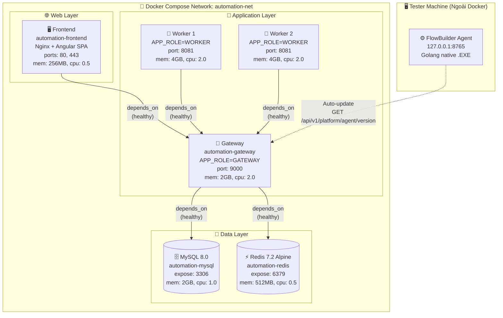

---

## 13. Bảo Mật & Xác Thực (Security Overview)

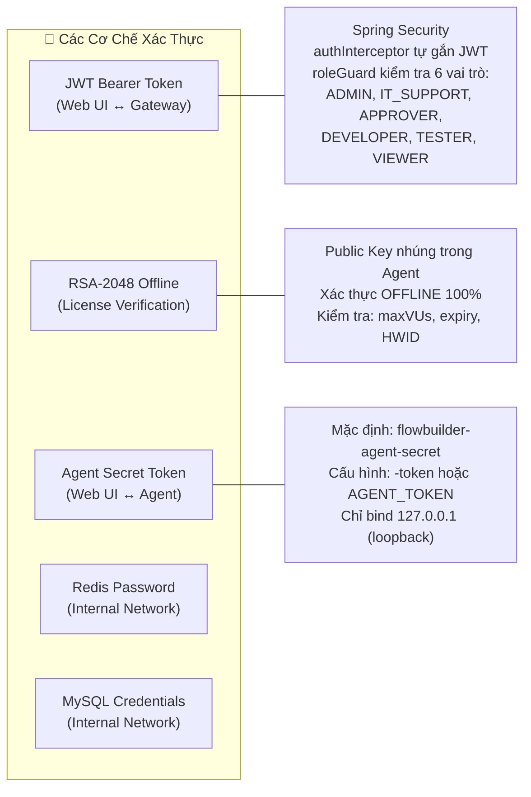

---

> **Cập nhật lần cuối**: 2026-09-14
