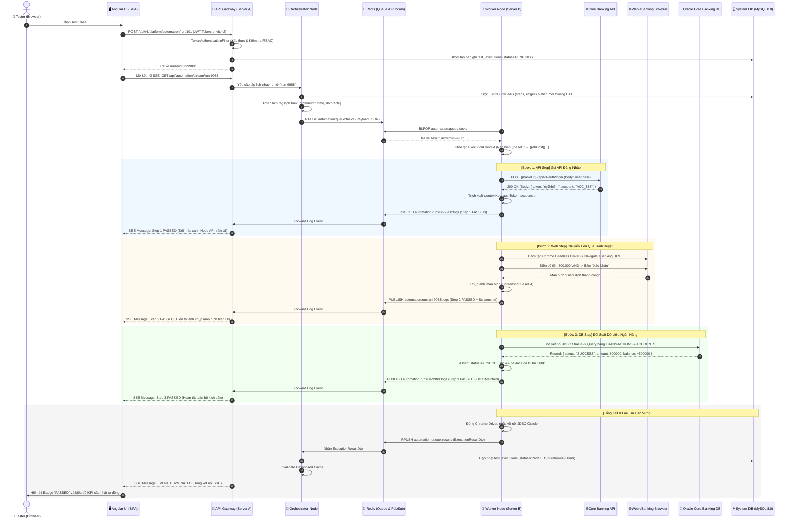

# 🏛️ Kiến Trúc Hệ Thống Backend (FlowBuilder Automation Engine)

Tài liệu này mô tả chi tiết kiến trúc tổng thể, mô hình phân tán, các tầng xử lý (Layers), cơ chế điều phối hàng đợi (Distributed Task Queue), động cơ thực thi kịch bản đa nền tảng (Multi-Platform Execution Engine) và mô hình dữ liệu của Backend hệ thống **FlowBuilder Automation Platform**.

---

## 1. Tổng Quan Kiến Trúc (Architecture Overview)

Backend của **FlowBuilder** được thiết kế theo mô hình **Distributed Event-Driven & Worker-Pool Architecture** (Kiến trúc phân tán hướng sự kiện với cụm worker xử lý song song), kết hợp công nghệ **Spring Boot 2.7 / Java 11**, **Redis 7.2 (Pub/Sub & Task Queue)**, **MySQL 8.0** và **Docker Containerization**.

```mermaid
flowchart TB
    subgraph ClientLayer ["1. CLIENT & PRESENTATION LAYER"]
        UI["Angular 19 SPA (TailAdmin UI)"]
        BrowserTab["SSE Realtime Stream Viewer"]
    end

    subgraph GatewayLayer ["2. API GATEWAY & COORDINATOR (Port: 9000)"]
        Nginx["Nginx Reverse Proxy / Static Host"]
        AuthFilter["TokenAuthenticationFilter / RBAC"]
        REST["REST API Controllers\n(Project, TestCase, Suite, Env, User, Dashboard)"]
        SSEHub["SSE Event Stream Controller\n(/api/automation/stream/{runId})"]
        TaskDispatcher["Task Dispatcher & Scheduler"]
    end

    subgraph MessageBus ["3. DISTRIBUTED MESSAGE BUS (Redis 7.2)"]
        TaskQueue[("Redis Task Queue\n(List / RPUSH / BLPOP)")]
        EventPubSub[("Redis Pub/Sub Event Bus\n(Realtime Step Logs & Progress)")]
        DistributedCache[("Redis / In-Memory Cache\n(Stats, Environments, Roles)")]
    end

    subgraph WorkerPool ["4. DISTRIBUTED WORKER CLUSTER (Scaled N Instances)"]
        Worker1["Worker Instance #1\n(AutomationRunner)"]
        Worker2["Worker Instance #2\n(AutomationRunner)"]
        WorkerN["Worker Instance #N\n(AutomationRunner)"]
    end

    subgraph ExecutorEngine ["5. MULTI-PLATFORM EXECUTOR SUITE"]
        ApiExec["API Test Executor\n(Apache HttpClient5)"]
        WebExec["Web Test Executor\n(Selenium / Chrome Headless)"]
        MobileExec["Mobile Test Executor\n(Appium Driver)"]
        ScriptExec["Script & Assertion Engine\n(JavaScript Sandbox)"]
    end

    subgraph Persistence ["6. PERSISTENCE LAYER (MySQL 8.0)"]
        DB[(MySQL 8.0 Database\nautomation_db)]
    end

    UI -->|HTTP / REST| Nginx
    Nginx -->|Proxy API Requests| REST
    BrowserTab -->|Server-Sent Events (SSE)| SSEHub
    REST --> AuthFilter
    AuthFilter --> TaskDispatcher
    TaskDispatcher -->|Enqueues Job| TaskQueue
    TaskQueue -->|Worker Consumer Loop| Worker1 & Worker2 & WorkerN
    Worker1 & Worker2 & WorkerN -->|Publishes Step Events| EventPubSub
    EventPubSub -->|Subscribes & Bridges Log| SSEHub
    Worker1 & Worker2 & WorkerN --> ExecutorEngine
    ExecutorEngine -->|Queries & Updates| Persistence
    REST -->|JPA Transactions| Persistence
```

---

## 2. Phân Tầng Hệ Thống (Layered Architecture)

### 2.1. Web & REST Layer (`com.bank.automation.web.rest`)
Tiếp nhận và xác thực tất cả các yêu cầu từ Frontend SPA:
- **`ProjectController`**: Quản lý dự án, phân trang, gán người dùng.
- **`TestCaseController`**: Lưu trữ kịch bản dưới dạng JSON Flow Canvas, cấu hình DAG node, edges, validation.
- **`TestSuiteController`**: Quản lý nhóm kịch bản, cấu hình chạy hàng loạt.
- **`EnvironmentController`**: Cấu hình biến môi trường đa cấp (`Dev`, `UAT`, `Staging`, `Prod`).
- **`DashboardController`**: Tổng hợp KPI, Pass/Fail rate, xu hướng kiểm thử theo thời gian thực.
- **`AutomationController`**: Điểm kích hoạt chạy kịch bản (`POST /api/automation/run/{id}`), điều khiển tạm dừng/hủy và mở kênh SSE streaming (`GET /api/automation/stream/{runId}`).

### 2.2. Bảo Mật & Phân Quyền (Security & Multi-Tenant Isolation)
- **TokenAuthenticationFilter**: Đọc Bearer Token / Custom Session Header, giải mã và nạp `UserPrincipal` vào `SecurityContextHolder`.
- **CurrentUserService**:
  - `requireUser()`: Đảm bảo request đã xác thực.
  - `requireProjectAccess(userId, projectId)`: Kiểm tra quyền truy cập theo từng dự án (Multi-tenant data isolation).
  - Tự động nhận diện Role: `ADMIN`, `TESTER`, `DEVELOPER`, `VIEWER`.
- **RoleMapper**: Chuyển đổi hai chiều giữa Role ID trong Database và định danh UI.

---

## 3. Động Cơ Thực Thi Phân Tán (Execution Engine & Orchestrator)

### 3.1. Cơ Chế Điều Phối (Task Dispatcher & Redis Queue)
```
[User Click Run]
       │
       ▼
[Gateway: AutomationController] ──► Tạo `runId` duy nhất
       │
       ▼
[TaskDispatcher] ───────────────► Đóng gói ExecutionContext & Push vào Redis Queue
       │
       ▼
[Redis Task Queue] ─────────────► Phân phối theo cơ chế First-Come First-Served
       │
       ▼
[Worker Cluster] ───────────────► Worker nhàn rỗi nhận Job, khởi tạo Thread độc lập
```

### 3.2. Cấu Trúc Động Cơ Thực Thi (`AutomationRunner`)
`AutomationRunner` là bộ điều phối trung tâm phụ trách:
1. **Khởi tạo Ngữ cảnh (`ExecutionContext`)**: Nạp biến môi trường (`ProjectEnvironment`), biến toàn cục và tham số đầu vào.
2. **Giải mã Sơ đồ Kịch bản (DAG Flow Engine)**: Đọc danh sách các bước (`steps`), sơ đồ liên kết (`edges`), điều kiện rẽ nhánh (`IF / ELSE`), vòng lặp (`LOOP`), và các bộ xử lý lỗi (`ON_ERROR`).
3. **Thay thế biến động (`Variable Interpolator`)**: Quét toàn bộ dữ liệu kiểm thử theo cú pháp `{{tên_biến}}` và thay thế bằng giá trị thực tế trong Runtime Context.
4. **Điều hướng Executor tương ứng**:
   - **`API`** ➔ `ApiTestExecutor`: Thực hiện HTTP Request (GET/POST/PUT/PATCH/DELETE), hỗ trợ Header, Param, Basic/Bearer/ApiKey Auth, Multipart form-data, Raw JSON payload.
   - **`WEB`** ➔ `WebTestExecutor`: Điều khiển trình duyệt qua Selenium/Chrome Headless, hỗ trợ Click, Type, Hover, Wait, Assert Element, Chụp ảnh màn hình (Screenshot).
   - **`MOBILE`** ➔ `MobileTestExecutor`: Gửi lệnh tới Appium Server để tương tác với thiết bị di động Android/iOS.
   - **`SCRIPT`** ➔ `ScriptExecutor`: Chạy mã script JavaScript / Groovy trong môi trường Sandbox để tính toán logic phức tạp, mã hóa HMAC, Base64, sinh dữ liệu ngẫu nhiên.
   - **`DATABASE`** ➔ `DatabaseExecutor`: Thực thi câu lệnh SQL để truy vấn hoặc kiểm tra tính toàn vẹn dữ liệu trong cơ sở dữ liệu đích.
5. **Trích xuất dữ liệu (`Extractions`)**: Sau khi bước chạy xong, trích xuất dữ liệu từ Response JSON (JSONPath `$.data.id`), Response Header hoặc Regex để lưu vào Context phục vụ các bước tiếp theo.

---

## 4. Cơ Chế Truyền Tin Nhật Ký Thời Gian Thực (SSE & Redis Pub/Sub)

Để người dùng trên trình duyệt có thể theo dõi tiến độ chạy từng bước (Step-by-step Execution Log) mà không bị nghẽn mạng hay lag giao diện:

```
[Worker Executor] 
       │ (Phát sinh Log / Step Passed / Step Failed)
       ▼
[Redis Publisher] ──► Topic: `automation:run:{runId}:logs`
                            │
                            ▼
                    [Redis Pub/Sub Bus]
                            │
                            ▼
[Gateway Redis Subscriber] ──► Nhận message từ Redis
       │
       ▼
[SseEmitter Controller] ────► Đẩy trực tiếp gói tin SSE về Browser của Client
```

- **Ưu điểm**:
  - Hỗ trợ mở rộng không giới hạn: Worker và Gateway có thể nằm ở các container/máy chủ vật lý khác nhau mà vẫn streaming log mượt mà.
  - Tự động đóng kết nối và dọn dẹp Emitter khi hoàn thành kịch bản (`TERMINATED`).

---

## 5. Mô Hình Dữ Liệu (Database Schema & Entity Models)

Hệ thống lưu trữ trên **MySQL 8.0** với các bảng chính:

```
+-----------------------------------------------------------------------------------+
|                                  CƠ SỞ DỮ LIỆU                                    |
+-----------------------------------------------------------------------------------+
|  1. projects             : ID, projectName, description, updatedAt                |
|  2. users                : ID, username, password, email, fullName, active        |
|  3. roles                : ID, roleName (Admin, Tester, Developer, Viewer)       |
|  4. project_users        : (project_id, user_id) [Composite PK], role_id          |
|  5. json_test_cases      : ID, project_id, name, module, category, platforms...   |
|  6. json_test_case_detail: test_case_id (FK), steps (JSON), edges, hooks...      |
|  7. test_suites          : ID, project_id, name, environment_id, test_case_ids   |
|  8. project_environments : ID, project_id, name, description                      |
|  9. environment_variables: ID, environment_id, var_key, var_value                 |
| 10. test_executions      : ID, project_id, test_case_id, status, duration, logs  |
+-----------------------------------------------------------------------------------+
```

### Chi tiết Mối Quan Hệ Chính:
1. **`Project` ──(1 : N)──► `TestCase`**: Một dự án chứa nhiều kịch bản kiểm thử.
2. **`TestCase` ──(1 : 1)──► `TestCaseDetail`**: Phân tách dữ liệu tóm tắt (phục vụ danh sách nhanh) và dữ liệu JSON Flow Canvas chi tiết (tránh tải nặng băng thông).
3. **`Project` ──(1 : N)──► `ProjectEnvironment` ──(1 : N)──► `EnvironmentVariable`**: Quản lý cấu hình biến môi trường độc lập cho từng dự án.
4. **`User` ◄──(N : M)──► `Project` (qua `ProjectUser`)**: Phân quyền chi tiết thành viên theo dự án.

---

## 6. Cơ Chế Quản Lý Biến & Ngữ Cảnh (Variable Scope & Precedence)

Khi thực thi một bước, hệ thống giải quyết biến theo thứ tự ưu tiên từ cao xuống thấp:

```
+-------------------------------------------------------------------------+
| MỨC 1 (Cao nhất) : Step Extractions & Runtime Context (Sinh ra từ bước trước) |
+-------------------------------------------------------------------------+
                                    │
                                    ▼
+-------------------------------------------------------------------------+
| MỨC 2            : Hook Variables & Pre-run Script Output               |
+-------------------------------------------------------------------------+
                                    │
                                    ▼
+-------------------------------------------------------------------------+
| MỨC 3            : Environment Variables (Biến môi trường Dev/UAT/Prod) |
+-------------------------------------------------------------------------+
                                    │
                                    ▼
+-------------------------------------------------------------------------+
| MỨC 4 (Thấp nhất): Built-in Global Functions (VD: {{$timestamp}}, {{$uuid}}) |
+-------------------------------------------------------------------------+
```

---

## 7. Khả Năng Mở Rộng & Chống Lỗi (Scalability & Fault Tolerance)

1. **Khả năng Scale-out Ngang (Horizontal Scaling)**:
   - Khi khối lượng kịch bản tăng cao, dễ dàng tăng số lượng worker bằng lệnh:
     ```bash
     docker compose up -d --scale automation-worker=5
     ```
   - Các worker tự động đăng ký và chia sẻ tải thông qua Redis Task Queue.
2. **Xử lý Đứt kết nối / Worker Failure**:
   - Nếu một Worker gặp sự cố khi đang chạy kịch bản, Gateway tự động bắt timeout và cập nhật trạng thái `FAILED` kèm thông báo lỗi rõ ràng.
3. **Tối ưu Hóa Bộ Nhớ Cache**:
   - Các dữ liệu đọc nhiều (Dashboard stats, Environment Variables, Role permissions) được cache tại chỗ và tự động xóa cache (`invalidateCache`) ngay khi có thao tác ghi hoặc hoàn thành đợt chạy.

---

## 8. Hướng Dẫn Vận Hành & Triển Khai (Deployment Guide)

### Yêu Cầu Môi Trường:
- **Docker & Docker Compose**
- **Java 11+ & Maven 3.8+** (nếu build thủ công bên ngoài container)

### Khởi Động Toàn Bộ Hệ Thống:
```bash
# 1. Khởi động MySQL, Redis, Gateway, Worker Cluster và Nginx Frontend
docker compose up -d --build

# 2. Kiểm tra trạng thái các container
docker ps --format "table {{.Names}}\t{{.Status}}\t{{.Ports}}"
```

---

---

## 9. Mô Hình Triển Khai Phân Tán Đa Máy Chủ với Node Quản Lý Điều Phối & Kết Nối Database (Distributed Orchestrator & DB Architecture)

Trong môi trường kiểm thử doanh nghiệp (Enterprise Test Automation), kiến trúc mở rộng theo mô hình **Master Coordinator (Node Quản lý & Điều phối) - Multi-Worker Nodes** kết hợp với **Kiến trúc Kết nối Database Đa Tầng**.

```mermaid
flowchart TB
    subgraph ClientLayer ["1. CLIENT LAYER"]
        UI["Angular 19 SPA (Tester / QA Lead)"]
        BrowserSSE["SSE Realtime Stream Viewer"]
    end

    subgraph MasterHost ["2. MÁY CHỦ QUẢN LÝ TRUNG TÂM (Master Node / Server A)"]
        direction TB
        APIGateway["REST API Gateway\n(Auth, Projects, TestCases)"]
        
        subgraph OrchestratorNode ["🧠 NODE QUẢN LÝ & ĐIỀU PHỐI (Master Orchestrator)"]
            WorkerRegistry["Worker Registry & Heartbeat Monitor\n(Theo dõi RAM/CPU/Slots của từng Worker)"]
            SmartScheduler["Smart Dynamic Scheduler\n(Định tuyến Task theo Tag: OS, Browser, Device)"]
            TaskWatchdog["Task Watchdog & Failover Recovery\n(Tự động thu hồi task nếu Worker gặp sự cố)"]
            ResultIngestor["Result Ingestion & Batch Writer\n(Ghi nhận kết quả thực thi vào DB)"]
        end

        subgraph CentralStorage ["Kho Lưu Trữ & Message Bus Trung Tâm"]
            RedisMaster[("Redis 7.2 Cluster\n• Dedicated Queues: task:web, task:api, task:ios\n• Pub/Sub Log Stream\n• Worker Heartbeat Keys")]
            SystemDB[("MySQL 8.0 Master (automation_db)\n• Lưu TestCases, Users, Envs, TestExecutions")]
        end
    end

    subgraph WorkerFleet ["3. CỤM WORKER ĐA MÁY CHỦ (Distributed Worker Nodes)"]
        subgraph MachineB ["🐧 WORKER NODE 1 (Linux High-Compute VM)"]
            WorkerB["Worker Process #1\nTags: [linux, chrome, api]"]
            ChromeFarm["Chrome / Firefox Headless Grid"]
        end

        subgraph MachineC ["🪟 WORKER NODE 2 (Windows Dedicated PC)"]
            WorkerC["Worker Process #2\nTags: [windows, edge, desktop]"]
            WinApp["WinAppDriver & Edge Browser"]
        end

        subgraph MachineD ["🍏 WORKER NODE 3 (macOS / Mobile Device Lab)"]
            WorkerD["Worker Process #3\nTags: [mac, ios, android, appium]"]
            AppiumFarm["Appium Server & Real Devices"]
        end
    end

    subgraph TargetSUT ["4. TARGET SYSTEM UNDER TEST (Cơ Sở Dữ Liệu Ứng Dụng Được Kiểm Thử)"]
        CoreBankingDB[("Oracle 19c / PostgreSQL\nCore Banking DB (SUT)")]
        PaymentDB[("MySQL / MS SQL Server\nPayment Gateway DB (SUT)")]
    end

    %% Client kết nối đến Gateway
    UI -->|HTTP / REST| APIGateway
    BrowserSSE <-->|Server-Sent Events (SSE)| APIGateway

    %% Gateway & Orchestrator
    APIGateway --> OrchestratorNode
    OrchestratorNode -->|Ghi nhận kịch bản & phân tích| SystemDB
    OrchestratorNode -->|Đẩy Task vào Queue phù hợp| RedisMaster

    %% Worker kết nối về Redis & DB Trung Tâm
    WorkerB -.->|"Heartbeat (mỗi 5s)"| RedisMaster
    WorkerC -.->|"Heartbeat (mỗi 5s)"| RedisMaster
    WorkerD -.->|"Heartbeat (mỗi 5s)"| RedisMaster

    RedisMaster -.->|"Pull Task theo Tag chuyên biệt"| WorkerB & WorkerC & WorkerD
    WorkerB & WorkerC & WorkerD -.->|"Publish Realtime Logs & Screenshots"| RedisMaster
    WorkerB & WorkerC & WorkerD -.->|"Gửi Result Payload"| ResultIngestor
    ResultIngestor -->|JPA Batch Insert / Update| SystemDB

    %% Worker tương tác với DB ứng dụng được test
    WorkerB & WorkerC -->|DatabaseExecutor (JDBC Query / Assert)| CoreBankingDB & PaymentDB
```

---

### 9.1. Vai Trò Của Node Quản Lý & Điều Phối (Master Orchestrator)

Node Quản lý Điều phối đóng vai trò là "Bộ não" trung tâm của toàn bộ hệ thống:

1. **Quản Lý Danh Sách & Sức Khỏe Worker (Worker Registry & Heartbeat)**:
   - Mỗi máy Worker khi khởi động sẽ tự động gửi gói tin đăng ký (Register) kèm theo **Metadata cấu hình**:
     - Số lượng slot chạy song song tối đa (`maxConcurrency: 5`).
     - Danh sách Capabilities/Tags (`['os:windows', 'browser:edge', 'platform:desktop']`).
     - Địa chỉ IP máy, dung lượng RAM, CPU hiện tại.
   - Worker định kỳ gửi Heartbeat (5s/lần) cập nhật vào Redis `SETEX worker:node:{id} 10 {...}`. Nếu sau 10s không có Heartbeat, Orchestrator tự động đánh dấu Worker là `OFFLINE`.

2. **Định Tuyến Kịch Bản Thông Minh (Targeted Dynamic Scheduling)**:
   - Thay vì đẩy tất cả task vào một hàng đợi chung, Orchestrator phân tích yêu cầu của kịch bản và đẩy vào đúng Queue chuyên biệt:
     - Kịch bản Web Chrome/API ➔ Hàng đợi `automation:queue:general` (Máy Linux / Server B xử lý).
     - Kịch bản Desktop App / Edge ➔ Hàng đợi `automation:queue:windows` (Máy Windows / Server C xử lý).
     - Kịch bản Mobile App iOS/Android ➔ Hàng đợi `automation:queue:mobile` (Máy macOS / Server D xử lý).

3. **Chống Treo & Tự Phục Hồi Tác Vụ (Watchdog & Dead-Letter Recovery)**:
   - Nếu một máy Worker bị mất điện hoặc crash giữa chừng khi đang chạy kịch bản:
   - Task Watchdog phát hiện Task bị quá thời gian timeout mà không nhận được Heartbeat từ Worker đó, nó sẽ tự động **thu hồi Task**, cập nhật log cảnh báo và **điều phối lại (Re-dispatch)** sang một Worker khác còn sống.

---

### 9.2. Kiến Trúc Kết Nối Cơ Sở Dữ Liệu (Database Connectivity Architecture)

Hệ thống phân tách rõ ràng thành **2 Tầng Cơ Sở Dữ Liệu**:

#### Tầng 1: Cơ Sở Dữ Liệu Hệ Thống Quản Lý Automation (`System Management DB`)
- **Mục đích**: Lưu trữ thông tin Projects, Test Cases, Flow Canvas JSON, User RBAC, Environment Variables và Lịch sử chạy (`test_executions`).
- **Cơ chế kết nối**:
  - **Gateway & Orchestrator**: Kết nối trực tiếp vào MySQL qua **HikariCP Connection Pool** (tối đa 50-100 connections), tối ưu hóa Transaction và Batching.
  - **Remote Workers (Mô hình Ingestion an toàn)**: Các máy Worker ở xa **không cần mở kết nối JDBC thô trực tiếp vào MySQL trung tâm** (tránh làm tràn Connection Pool và không cần mở cổng 3306 ra ngoài Internet). Worker đẩy gói tin kết quả cuối cùng (`ExecutionResultDto`) vào Redis Queue ➔ `ResultIngestor` trên Master Node sẽ đọc và ghi Batch vào MySQL.

#### Tầng 2: Cơ Sở Dữ Liệu Của Ứng Dụng Được Kiểm Thử (`Target System Under Test DBs`)
- **Mục đích**: Các hệ thống cơ sở dữ liệu của ứng dụng ngân hàng/doanh nghiệp mà kịch bản test cần truy vấn dữ liệu mẫu (Test Data) hoặc kiểm tra tính đúng đắn (Data Assertion).
- **Cơ chế kết nối**:
  - Trong kịch bản kiểm thử, khi có bước dạng `DATABASE` (SQL Query / Verification):
  - `DatabaseExecutor` trên máy Worker sẽ sử dụng JDBC Driver tương ứng (Oracle Thin Driver, MySQL Connector, PostgreSQL JDBC, MS SQL JDBC) để kết nối trực tiếp tới DB đích theo chuỗi kết nối và thông tin bảo mật được mã hóa trong `EnvironmentVariables`.
  - Hỗ trợ kết nối qua **SSH Tunnel / Bastion Host** nếu Database đích nằm trong mạng cô lập (Private Subnet).

---

### 9.3. Bảng So Sánh Luồng Dữ Liệu Giữa Các Thành Phần

| Thành Phần | Kết Nối Đến | Giao Thức | Mục Đích |
| :--- | :--- | :--- | :--- |
| **Angular Web Client** | API Gateway (Server A) | `HTTP/REST (9000)` & `SSE (9000)` | Gửi lệnh quản lý, bấm Run, xem kết quả và stream log thời gian thực |
| **Orchestrator Node** | Redis Cluster (Server A) | `TCP (6379)` | Đẩy task vào queue, kiểm tra heartbeat của worker |
| **Orchestrator Node** | System MySQL (Server A) | `JDBC / HikariCP (3306)` | Đọc kịch bản, ghi lịch sử chạy và thống kê KPI Dashboard |
| **Remote Worker Nodes** | Redis Cluster (Server A) | `TCP (6379)` | Kéo task về chạy, gửi heartbeat, publish realtime step logs |
| **Remote Worker Nodes** | Target Application DBs | `JDBC (Oracle / Postgres / SQL)` | Thực thi câu lệnh SQL nghiệp vụ trong các bước kiểm thử |

---

### 9.4. Hướng Dẫn Khởi Chạy Worker Node Kèm Theo Tag Định Tuyến

Trên máy tính phụ (Ví dụ: Máy Windows chạy Desktop Automation), khởi chạy Worker kèm theo định danh Tag:

```bash
docker run -d \
  --name automation-worker-windows \
  --restart always \
  -e SPRING_REDIS_HOST=192.168.1.100 \
  -e SPRING_REDIS_PORT=6379 \
  -e AUTOMATION_MODE=WORKER \
  -e WORKER_ID=worker-win-01 \
  -e WORKER_TAGS="os:windows,browser:edge,platform:desktop" \
  -e WORKER_MAX_CONCURRENCY=3 \
  free-angular-tailwind-dashboard-main-automation-worker:latest
```
*(Node Quản lý Điều phối trên Server A sẽ tự động nhận diện Worker này và chỉ định tuyến các kịch bản liên quan đến Windows/Edge/Desktop về máy này)*

---

## 10. Luồng Hoạt Động Chi Tiết Từ UI Xuống Hạ Tầng (End-to-End Execution Trace)

Dưới đây là hành trình chi tiết của **1 lượt chạy kịch bản kiểm thử mẫu** (Kịch bản: *Đăng nhập qua API ➔ Thực hiện Giao dịch trên Web Banking ➔ Đối soát Số dư trong Database Core Banking*):



---

### Chi Tiết Từng Khâu Trong Luồng

| Khâu | Thành Phần | Chi Tiết Xử Lý |
| :--- | :--- | :--- |
| **1. UI Trigger** | Angular Web | Gửi request `POST /api/automation/run/101`, nhận `runId` và mở ngay luồng `EventSource` (SSE) để chờ log thời gian thực. |
| **2. Auth & Filter** | Gateway | `TokenAuthenticationFilter` kiểm tra chữ ký token và xác nhận user có quyền trong dự án chứa kịch bản này (`requireProjectAccess`). |
| **3. Dispatching** | Orchestrator | Phân tích DAG kịch bản, nạp biến môi trường từ MySQL, đóng gói Task và đẩy vào Redis Queue `automation:queue:tasks`. |
| **4. Task Polling** | Worker Node | Worker rảnh rỗi rút task qua `BLPOP`, khởi tạo `ExecutionContext` độc lập trong bộ nhớ RAM của máy Worker. |
| **5. Multi-Platform Exec** | Executors | `ApiTestExecutor` gọi API qua mạng; `WebTestExecutor` điều khiển trình duyệt; `DatabaseExecutor` mở kết nối JDBC đến DB nghiệp vụ. |
| **6. Realtime Logging** | Redis Pub/Sub | Mỗi khi một bước (Step) hoàn thành, Worker bắn log vào Redis Topic. Gateway chuyển tiếp tức thì qua SSE về trình duyệt người dùng. |
| **7. Persistence & Cache** | Orchestrator & DB | Worker gửi kết quả cuối cùng qua Redis Result Queue. Orchestrator lưu vào MySQL và xóa cache dashboard để số liệu KPI cập nhật mới nhất. |

---

## 9. Kiến Trúc Bảo Mật & Bản Quyền Phân Tán (Enterprise Licensing & Anti-Tamper)

Hệ thống FlowBuilder tích hợp kiến trúc bảo vệ bản quyền đa tầng và cơ chế chống dịch ngược cấp doanh nghiệp:

### 9.1. Cơ Chế Xác Thực Bất Đối Xứng RSA-2048 & HWID Fingerprinting
- **Chữ ký số RSA-2048**: Payload bản quyền (JSON định danh khách hàng, hạn ngạch Worker/Testcase/Tính năng, ngày hết hạn) được ký số bằng Khóa bí mật (Private Key) của Vendor và xác thực tại Gateway/Worker bằng Khóa công khai (Public Key).
- **Khóa phần cứng (HWID)**: Băm SHA-256 từ thông tin phần cứng máy chủ (MAC Address, Machine ID, CPU/OS) hoặc gán qua biến môi trường `SERVER_HWID` đồng bộ trong cụm Docker.

### 9.2. Đồng Bộ Trạng Thái Cụm Phân Tán Qua Redis Pub/Sub
- Trạng thái giấy phép được lưu trữ bền vững tại bảng `system_licenses` trong MySQL (`ACTIVE` / `INACTIVE`).
- Khi người quản trị nạp hoặc thay đổi giấy phép, Gateway phát sự kiện qua kênh Redis `automation:license_channel`. Tất cả các Worker node trong cụm tự động đồng bộ trạng thái mới vào bộ nhớ RAM trong < 5ms mà không cần khởi động lại dịch vụ.

### 9.3. Phân Quyền Vận Hành & Quản Trị Bản Quyền (RBAC)
- **`ADMIN`**: Xem trạng thái bản quyền, nạp giấy phép mới `.lic` qua giao diện Web.
- **`IT_SUPPORT`**: Cổng quản trị chuyên biệt (`/system/licenses`, `/system/users`), đổi mật khẩu, đồng bộ người dùng, quản lý kích hoạt/hủy giấy phép (có thể inactive license của Admin, xóa license do chính IT Support upload - không được xóa license của Admin). Miễn trừ khỏi popup chặn license.
- **`TESTER` / `DEVELOPER` / `VIEWER`**: Xem thông tin bản quyền; nếu chưa kích hoạt hoặc hết hạn, giao diện hiển thị badge nhấp nháy đỏ `Kích hoạt License` kèm icon khiên dấu X và chặn thực thi test.

### 9.4. Làm Rối Mã Nguồn (ProGuard Obfuscation)
- Tích hợp Maven ProGuard Plugin tự động trong `Dockerfile` (profile `obfuscate`).
- Toàn bộ package nghiệp vụ bảo mật `com.bank.automation.core.security.**` được mã hóa/làm rối, loại bỏ thông tin gỡ lỗi, bảo vệ tài sản sở hữu trí tuệ khi đóng gói chuyển giao cho khách hàng.

> 📖 **Xem chi tiết tài liệu hướng dẫn bàn giao và triển khai:** [DEPLOYMENT_AND_LICENSE_GUIDE.md](file:///d:/Project/AutomationUi/Backend/docs/DEPLOYMENT_AND_LICENSE_GUIDE.md)


