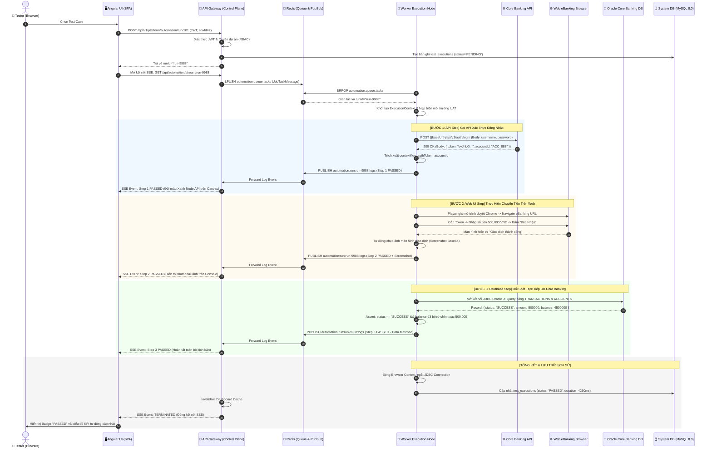
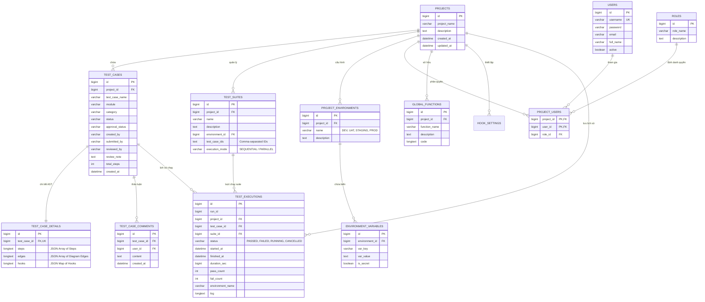

# TÀI LIỆU ĐẶC TẢ NGHIỆP VỤ & SẢN PHẨM CHUẨN DOANH NGHIỆP
# (ENTERPRISE PRODUCT BUSINESS REQUIREMENTS & ARCHITECTURE SPECIFICATION)

---

| THÔNG TIN DỰ ÁN | CHI TIẾT |
| :--- | :--- |
| **Tên sản phẩm** | **Automation UI Builder** *(FlowBuilder Automation Platform)* |
| **Mã tài liệu** | `PRD-BRD-AUTO-2026-V3.0` |
| **Phiên bản** | `3.0 Enterprise Edition` |
| **Ngày ban hành** | `07/09/2026` |
| **Phạm vi áp dụng** | Nền tảng Kiểm thử Tự động Hóa Toàn Diện Cấp Doanh nghiệp & Ngân hàng (Banking Grade) |
| **Trạng thái tài liệu** | **Official Baseline / Approved for Enterprise Rollout** |
| **Đối tượng độc giả** | Product Owner, Business Analyst, QA Lead, SDET, Backend/Frontend Architect, DevOps, C-Level / Stakeholders |

---

## MỤC LỤC

1. [TỔNG QUAN ĐIỀU HÀNH & TẦM NHÌN SẢN PHẨM (EXECUTIVE SUMMARY & PRODUCT VISION)](#1-tổng-quan-điều-hành--tầm-nhìn-sản-phẩm-executive-summary--product-vision)
2. [ĐỐI TƯỢNG SỬ DỤNG & MA TRẬN GIÁ TRỊ DOANH NGHIỆP (PERSONAS & VALUE MATRIX)](#2-đối-tượng-sử-dụng--ma-trận-giá-trị-doanh-nghiệp-personas--value-matrix)
3. [KIẾN TRÚC SẢN PHẨM & HỆ SINH THÁI TỔNG THỂ (PRODUCT ARCHITECTURE & ECOSYSTEM)](#3-kiến-trúc-sản-phẩm--hệ-sinh-thái-tổng-thể-product-architecture--ecosystem)
4. [ĐẶC TẢ CHI TIẾT CÁC PHÂN HỆ SẢN PHẨM (CORE PRODUCT MODULES SPECIFICATION)](#4-đặc-tả-chi-tiết-các-phân-hệ-sản-phẩm-core-product-modules-specification)
   - [4.1. Phân Hệ Quản Trị Dự Án & Phân Quyền Đa Cấp (Project Workspace & RBAC)](#41-phân-hệ-quản-trị-dự-án--phân-quyền-đa-cấp-project-workspace--rbac)
   - [4.2. Phân Hệ Trình Soạn Thảo Kịch Bản Trực Quan & Đồng Bộ 3 Chiều (Visual Flowbuilder Canvas & AST Engine)](#42-phân-hệ-trình-soạn-thảo-kịch-bản-trực-quan--đồng-bộ-3-chiều-visual-flowbuilder-canvas--ast-engine)
   - [4.3. Phân Hệ Khối Lệnh Cấu Trúc & Danh Mục Thao Tác (Control Flow Containers & Action Catalog)](#43-phân-hệ-khối-lệnh-cấu-trúc--danh-mục-thao-tác-control-flow-containers--action-catalog)
   - [4.4. Phân Hệ Tiện Ích Ghi Thao Tác Trình Duyệt (Web Recorder Chrome Extension Companion)](#44-phân-hệ-tiện-ích-ghi-thao-tác-trình-duyệt-web-recorder-chrome-extension-companion)
   - [4.5. Phân Hệ Quản Lý Môi Trường & Động Cơ Biến Động (Environments & Dynamic Variables)](#45-phân-hệ-quản-lý-môi-trường--động-cơ-biến-động-environments--dynamic-variables)
   - [4.6. Phân Hệ Quản Lý Bộ Kịch Bản & Thực Thi Hàng Loạt (Test Suites & Bulk Execution)](#46-phân-hệ-quản-lý-bộ-kịch-bản--thực-thi-hàng-loạt-test-suites--bulk-execution)
   - [4.7. Phân Hệ Động Cơ Thực Thi Phân Tán & Cụm Worker Đa Nền Tảng (Distributed Execution Engine & Worker Fleet)](#47-phân-hệ-động-cơ-thực-thi-phân-tán--cụm-worker-đa-nền-tảng-distributed-execution-engine--worker-fleet)
   - [4.8. Phân Hệ Giám Sát Thực Thi Thời Gian Thực & Nhật Ký Bước (Live Execution Console & SSE Stream)](#48-phân-hệ-giám-sát-thực-thi-thời-gian-thực--nhật-ký-bước-live-execution-console--sse-stream)
   - [4.9. Phân Hệ Quản Trị Xét Duyệt Chất Lượng & Cộng Tác (Quality Governance, Approvals & Comments)](#49-phân-hệ-quản-trị-xét-duyệt-chất-lượng--cộng-tác-quality-governance-approvals--comments)
   - [4.10. Phân Hệ Thư Viện Hàm Dùng Chung & Vòng Đời Kiểm Thử (Global Functions & Lifecycle Hooks)](#410-phân-hệ-thư-viện-hàm-dùng-chung--vòng-đời-kiểm-thử-global-functions--lifecycle-hooks)
   - [4.11. Phân Hệ Báo Cáo Quản Trị, KPI & Chẩn Đoán Lỗi Chuẩn Allure (Dashboard Analytics & Diagnostics)](#411-phân-hệ-báo-cáo-quản-trị-kpi--chẩn-đoán-lỗi-chuẩn-allure-dashboard-analytics--diagnostics)
   - [4.12. Phân Hệ Trợ Lý AI Sinh Kịch Bản Tự Động (AI-Powered Flow Generator)](#412-phân-hệ-trợ-lý-ai-sinh-kịch-bản-tự-động-ai-powered-flow-generator)
5. [QUY TRÌNH NGHIỆP VỤ & HÀNH TRÌNH NGƯỜI DÙNG (BUSINESS WORKFLOWS & USER JOURNEYS)](#5-quy-trình-nghiệp-vụ--hành-trình-người-dùng-business-workflows--user-journeys)
6. [MÔ HÌNH DỮ LIỆU NGHIỆP VỤ & TỪ ĐIỂN THỰC THỂ (DATA ARCHITECTURE & DOMAIN MODEL)](#6-mô-hình-dữ-liệu-nghiệp-vụ--từ-điển-thực-thể-data-architecture--domain-model)
7. [YÊU CẦU PHI CHỨC NĂNG & TIÊU CHUẨN VẬN HÀNH (NON-FUNCTIONAL REQUIREMENTS & SLAS)](#7-yêu-cầu-phi-chức-năng--tiêu-chuẩn-vận-hành-non-functional-requirements--slas)
8. [TIÊU CHÍ NGHIỆM THU SẢN PHẨM & HIỆU QUẢ ĐẦU TƯ (ACCEPTANCE CRITERIA & ROI)](#8-tiêu-chí-nghiệm-thu-sản-phẩm--hiệu-quả-đầu-tư-acceptance-criteria--roi)

---

## 1. TỔNG QUAN ĐIỀU HÀNH & TẦM NHÌN SẢN PHẨM (EXECUTIVE SUMMARY & PRODUCT VISION)

### 1.1. Bối cảnh & Thách thức Doanh nghiệp (Business Context & Challenges)
Trong quá trình chuyển đổi số và phát triển phần mềm doanh nghiệp/ngân hàng, hoạt động Kiểm thử phần mềm (Software Quality Assurance) thường gặp phải các điểm nghẽn nghiêm trọng:
1. **Rào cản kỹ thuật mã hóa (Coding Barrier)**: Các kỹ sư kiểm thử thủ công (Manual QA / Business Testers) gặp khó khăn khi tiếp cận các framework tự động hóa phức tạp (Selenium, Playwright, Appium) vốn đòi hỏi kỹ năng lập trình chuyên sâu.
2. **Kịch bản kiểm thử bị phân mảnh (Fragmented Test Silos)**: Kiểm thử Web UI, kiểm thử REST API, kiểm thử cơ sở dữ liệu (Database SUT) và kiểm thử ứng dụng di động bị tách biệt trên nhiều công cụ riêng rẽ (Postman, Selenium IDE, JMeter, DBeaver), không thể kết nối thành luồng nghiệp vụ liên thông đầu-cuối (End-to-End Financial Flows).
3. **Hiệu năng & Khả năng mở rộng kém (Scalability Bottlenecks)**: Khi số lượng kịch bản kiểm thử tăng lên hàng chục ngàn hoặc hàng trăm ngàn test cases, các hệ thống kiểm thử truyền thống thường bị quá tải, thời gian chạy hồi quy (Regression Testing) kéo dài nhiều ngày, giao diện dashboard bị treo và thiếu cơ chế điều phối phân tán.
4. **Thiếu quy trình kiểm duyệt chất lượng (Quality Governance & Approval Gate)**: Kịch bản kiểm thử không được quản lý phiên bản, thiếu cơ chế phê duyệt trước khi đưa vào bộ kịch bản kiểm thử hồi quy chính thức.

### 1.2. Tuyên ngôn Sản phẩm & Định vị Thị trường (Product Positioning & Value Proposition)
**Automation UI Builder** *(FlowBuilder Automation Platform)* là nền tảng kiểm thử tự động hóa thế hệ mới kết hợp sức mạnh **Low-Code / No-Code Flowbuilder** và **Pro-Code Scripting**, được thiết kế chuyên biệt cho các hệ sinh thái doanh nghiệp quy mô lớn:

> **"Một nền tảng duy nhất, kết nối toàn bộ hành trình kiểm thử từ Web UI, REST API, Database SQL đến Logic nghiệp vụ đa nhánh, đồng bộ 3 chiều thời gian thực giữa Sơ đồ trực quan, Bảng phân cấp và Mã nguồn TypeScript DSL, vận hành trên cụm thực thi phân tán chịu tải 600,000+ Test Cases với độ trễ phản hồi dưới 100ms."**

```
┌────────────────────────────────────────────────────────────────────────────────────────┐
│                              GIÁ TRỊ CỐT LÕI CỦA SẢN PHẨM                              │
├──────────────────────────┬──────────────────────────┬──────────────────────────────────┤
│    3-WAY SYNC ENGINE     │   CROSS-PLATFORM E2E     │       ENTERPRISE BIG DATA        │
│ Đồng bộ 2 chiều không    │ Hợp nhất Web Playwright, │ Vận hành 600,000+ Test Cases,    │
│ mất mát: Diagram Canvas  │ REST API, Database SQL,  │ Worker Pool phân tán, Realtime   │
│ <-> Table <-> DSL Code.  │ Mobile & Custom Script.  │ SSE, Allure Root-Cause Analytics.│
└──────────────────────────┴──────────────────────────┴──────────────────────────────────┘
```

---

## 2. ĐỐI TƯỢNG SỬ DỤNG & MA TRẬN GIÁ TRỊ DOANH NGHIỆP (PERSONAS & VALUE MATRIX)

Hệ thống phục vụ 5 nhóm người dùng cốt lõi trong chu trình phát triển và kiểm thử phần mềm:

```
┌──────────────────────────────────────────────────────────────────────────────────────────────────────────────┐
│                                       MA TRẬN CHÂN DUNG NGƯỜI DÙNG                                           │
├───────────────────┬──────────────────────────────────────────┬───────────────────────────────────────────────┤
│ PERSONA           │ NHU CẦU & ĐIỂM NGHẼN CHÍNH               │ GIẢI PHÁP MANG LẠI TRÊN FLOWBUILDER           │
├───────────────────┼──────────────────────────────────────────┼───────────────────────────────────────────────┤
│ 1. Manual QA &    │ • Không biết lập trình sâu.              │ • Kéo thả Node trực quan trên Diagram Canvas. │
│    Functional     │ • Tốn thời gian lặp lại test thủ công.   │ • Tiện ích Chrome Extension tự động ghi thao  │
│    Tester         │ • Cần thiết kế flow nhanh chóng.         │   tác và sinh kịch bản chỉ sau 1 click.       │
├───────────────────┼──────────────────────────────────────────┼───────────────────────────────────────────────┤
│ 2. SDET &         │ • Cần viết mã script tùy biến phức tạp.  │ • Monaco Code Editor hỗ trợ TypeScript DSL.   │
│    Automation     │ • Cần xử lý ký số HMAC, Token động.      │ • JavaScript Sandbox & Thư viện Global Funcs. │
│    Engineer       │ • Cần debug lỗi sâu từng step.           │ • Live Execution Console & Screenshot Zoom.   │
├───────────────────┼──────────────────────────────────────────┼───────────────────────────────────────────────┤
│ 3. Approver &     │ • Cần kiểm soát chất lượng kịch bản.     │ • Phân hệ Xét duyệt (Approve/Reject).         │
│    QA Lead /      │ • Cần theo dõi KPI, tiến độ toàn team.   │ • Ngăn kéo bình luận trực tiếp trên từng test.│
│    Test Manager   │ • Cần bộ kịch bản chuẩn hóa dùng chung.  │ • Phân loại Standard vs Common Test Cases.    │
├───────────────────┼──────────────────────────────────────────┼───────────────────────────────────────────────┤
│ 4. Developer /    │ • Cần chạy nhanh API & Web smoke test.   │ • Công cụ HTTP Tester tích hợp sẵn cURL.      │
│    Backend Eng    │ • Cần kiểm tra dữ liệu sau khi deploy.   │ • Node Database truy vấn trực tiếp DB SUT.    │
├───────────────────┼──────────────────────────────────────────┼───────────────────────────────────────────────┤
│ 5. CIO / CTO /    │ • Muốn rút ngắn thời gian Release.       │ • Cắt giảm 75% thời gian chạy kiểm thử hồi quy│
│    Project        │ • Cần báo cáo trực quan cho lãnh đạo.    │ • Báo cáo KPI, biểu đồ xu hướng 30 ngày, phân │
│    Manager        │ • Cần tối ưu chi phí hạ tầng kiểm thử.   │   loại lỗi Allure chuyên sâu.                 │
└───────────────────┴──────────────────────────────────────────┴───────────────────────────────────────────────┘
```

---

## 3. KIẾN TRÚC SẢN PHẨM & HỆ SINH THÁI TỔNG THỂ (PRODUCT ARCHITECTURE & ECOSYSTEM)

Hệ sinh thái **Automation UI Builder** được kiến trúc theo mô hình phân tầng **Distributed Event-Driven & Micro-Worker Architecture**:

```
                                  HỆ SINH THÁI TỔNG THỂ SẢN PHẨM
┌────────────────────────────────────────────────────────────────────────────────────────────────────────────────┐
│ 1. CLIENT & PRESENTATION LAYER (ANGULAR 19 SPA)                                                                │
│    ┌─────────────────────────┬─────────────────────────┬─────────────────────────┬────────────────────────┐    │
│    │  Diagram Visual Canvas  │  Table Step Hierarchy   │   Monaco Script DSL     │   Chrome Recorder Ext  │    │
│    │  (ng-diagram, Dagre)    │  (CDK Drag-Drop Tree)   │   (TypeScript Engine)   │   (TestCase Studio)    │    │
│    └─────────────────────────┴─────────────────────────┴─────────────────────────┴────────────────────────┘    │
│    ┌──────────────────────────────────────────────────────────────────────────────────────────────────────┐    │
│    │ 🧠 AST Flow Engine (2-Way Lossless Code <-> Flow Graph Synchronizer)                                  │    │
│    └──────────────────────────────────────────────────────────────────────────────────────────────────────┘    │
└───────────────────────────────────────────────────┬────────────────────────────────────────────────────────────┘
                                                    │ HTTPS / RESTful JSON / Server-Sent Events (SSE)
                                                    ▼
┌────────────────────────────────────────────────────────────────────────────────────────────────────────────────┐
│ 2. CONTROL PLANE & API GATEWAY (SPRING BOOT 2.7 / JAVA 11 - Port: 9000)                                       │
│    ├─ Security & JWT / RBAC Filter (Project Access Isolation, Created-By Ownership)                            │
│    ├─ Business Core: Project, TestCase, TestSuite, Environment, Variables, Global Functions, Hooks             │
│    ├─ Quality Governance: Approval Center, Review Comments, Audit Trail Engine                                │
│    ├─ AI Flow Generator (LLM Integration: OpenAI GPT-4 / Claude / Gemini API)                                  │
│    ├─ Task Coordinator & Smart Scheduler (Targeted Queue Routing)                                              │
│    └─ SSE Real-time Log Broadcaster & Redis Pub/Sub Bridge                                                     │
└──────────────────────────┬────────────────────────────────────────────────────────┬────────────────────────────┘
                           │                                                        │
                           ▼                                                        ▼
┌───────────────────────────────────────────────────┐    ┌───────────────────────────────────────────────────────┐
│ 3. PERSISTENCE LAYER (MYSQL 8.0 ENTERPRISE)       │    │ 4. DISTRIBUTED MESSAGE BUS (REDIS 7.2 ALPINES)        │
│ • Optimized Schema for 600k+ Test Cases & Runs    │    │ • Distributed Task Queues (automation:queue:tasks)    │
│ • Indexed (project_id, status, approval, created) │    │ • Pub/Sub Realtime Log Topics (automation:run:logs)   │
│ • LongText AST Flow & Topology Storage            │    │ • Emergency Cancel Channel (automation:control)       │
│ • HikariCP High-Throughput Connection Pool        │    │ • In-Memory Fast Cache & Worker Heartbeats            │
└───────────────────────────────────────────────────┘    └──────────────────────────┬────────────────────────────┘
                                                                                    │ BLPOP / Competing Consumers
                                                                                    ▼
┌────────────────────────────────────────────────────────────────────────────────────────────────────────────────┐
│ 5. DISTRIBUTED WORKER EXECUTION FLEET (MULTI-INSTANCE WORKER POOL)                                             │
│    ┌───────────────────────────┬───────────────────────────┬───────────────────────────┬──────────────────┐    │
│    │ Worker Node #1 (Linux VM) │ Worker Node #2 (Linux VM) │ Worker Node #3 (Win PC)   │ Worker Node #N   │    │
│    │ Capabilities: [Web, API]  │ Capabilities: [Web, API]  │ Capabilities: [Edge, Win] │ (Auto-scalable)  │    │
│    └─────────────┬─────────────┴─────────────┬─────────────┴─────────────┬─────────────┴────────┬─────────┘    │
│                  └───────────────────────────┼───────────────────────────┘                      │              │
│                                              ▼                                                  ▼              │
│    ┌──────────────────────────────────────────────────────────────────────────────────────────────────────┐    │
│    │ MULTI-PLATFORM EXECUTION ENGINES                                                                     │    │
│    │ ├─ Playwright Headless Engine (Browser Context Pool, Auto-wait, Network Interception)                │    │
│    │ ├─ REST API Client (Apache HttpClient5, Multipart, Auth, JSONPath Extractions)                      │    │
│    │ ├─ Database Test Engine (Direct JDBC: Oracle, PostgreSQL, MySQL, SQL Server)                         │    │
│    │ ├─ JavaScript Sandbox (Custom Scripts, HMAC/Crypto, Context Variables Manipulation)                  │    │
│    │ └─ Mobile Execution Adapter (Appium Client for Android / iOS)                                        │    │
│    └──────────────────────────────────────────────────────────────────────────────────────────────────────┘    │
└───────────────────────────────────────────────────┬────────────────────────────────────────────────────────────┘
                                                    │ JDBC Direct Queries & Assertions
                                                    ▼
┌────────────────────────────────────────────────────────────────────────────────────────────────────────────────┐
│ 6. TARGET SYSTEM UNDER TEST (SUT - HỆ THỐNG ĐƯỢC KIỂM THỬ)                                                     │
│    ├─ Core Banking Applications & Microservices                                                                │
│    ├─ Internet Banking / Mobile Banking Web Portals                                                           │
│    └─ Enterprise Databases (Oracle 19c, PostgreSQL, MySQL, MS SQL Server via SSH Tunnel / VPN)                 │
└────────────────────────────────────────────────────────────────────────────────────────────────────────────────┘
```

---

## 4. ĐẶC TẢ CHI TIẾT CÁC PHÂN HỆ SẢN PHẨM (CORE PRODUCT MODULES SPECIFICATION)

### 4.1. Phân Hệ Quản Trị Dự Án & Phân Quyền Đa Cấp (Project Workspace & RBAC)

#### A. Mục tiêu & Nghiệp vụ
Cung cấp không gian làm việc độc lập (Multi-project Isolation) cho từng phòng ban hoặc dự án phát triển phần mềm, đảm bảo an toàn dữ liệu và tuân thủ các quy định bảo mật khắt khe cấp Ngân hàng.

#### B. Các tính năng chính
1. **Quản lý Vòng đời Dự án (Project Lifecycle Management)**:
   - Tạo mới, cấu hình thông tin dự án (Tên dự án, Mô tả, Khách hàng, Trạng thái Hoạt động).
   - Tự động hiển thị tóm tắt KPI nhanh (Số lượng kịch bản, Số bộ test suites, Tỷ lệ thành công) ngay trên thẻ dự án.
2. **Thuật toán sinh Avatar 2 chữ cái viết tắt (Project Initials Algorithm)**:
   - Tự động làm sạch toàn bộ ký tự đặc biệt (`[`, `]`, `(`, `)`, `#`, `-`, `_`, `@`...).
   - Chuẩn hóa tiếng Việt không dấu (Loại bỏ toàn bộ Diacritics Unicode).
   - Tìm kiếm chính xác 2 ký tự đầu của 2 từ có nghĩa đầu tiên để hiển thị Avatar thương hiệu chuyên nghiệp.
3. **Mô hình Phân quyền 5 Cấp độ (5-Tier Role-Based Access Control - RBAC)**:
   - **`ADMIN`**: Toàn quyền cấu hình dự án, quản trị thành viên, gán quyền, duyệt kịch bản, xóa dự án.
   - **`APPROVER`**: Thẩm định kịch bản kiểm thử, thực hiện Phê duyệt (`APPROVE`) hoặc Từ chối (`REJECT`), để lại nhận xét nghiệp vụ.
   - **`DEVELOPER`**: Thiết kế kịch bản, quản lý biến môi trường, viết thư viện hàm dùng chung (Global Functions), quản trị Test Suites.
   - **`TESTER`**: Thiết kế kịch bản kiểm thử, chạy kiểm thử (Đơn lẻ & Hàng loạt), xem báo cáo và lịch sử thực thi.
   - **`VIEWER`**: Quyền chỉ đọc (Read-only), xem sơ đồ, xem kết quả chạy và bảng điều khiển báo cáo.
4. **Quy tắc Quyền sở hữu Kịch bản (`Created By` Data Ownership)**:
   - Mỗi kịch bản ghi nhận người khởi tạo (`createdBy`) và ngày tạo (`createdAt`).
   - Tester và Developer **chỉ có quyền chỉnh sửa hoặc xóa các kịch bản do chính mình tạo ra**, ngăn chặn rủi ro vô tình ghi đè dữ liệu của thành viên khác trong nhóm. Admin có quyền tối cao quản trị tất cả kịch bản.
5. **Tích hợp Đồng bộ Thư mục Người dùng Doanh nghiệp (LDAP / Active Directory Sync)**:
   - Hỗ trợ kết nối LDAP Server để đồng bộ tự động danh sách người dùng và trạng thái tài khoản vào hệ thống.

---

### 4.2. Phân Hệ Trình Soạn Thảo Kịch Bản Trực Quan & Đồng Bộ 3 Chiều (Visual Flowbuilder Canvas & AST Engine)

#### A. Mục tiêu & Nghiệp vụ
Trọng tâm trải nghiệm người dùng của sản phẩm: Cho phép mọi đối tượng (từ Manual QA không biết code đến chuyên gia SDET) cùng làm việc trên một kịch bản kiểm thử duy nhất thông qua **3 giao diện đồng bộ 2 chiều thời gian thực**.

```
┌────────────────────────────────────────────────────────────────────────────────────────┐
│                      ĐỒNG BỘ 3 CHIỀU THỜI GIAN THỰC (3-WAY LOSSLESS SYNC)               │
├──────────────────────────┬──────────────────────────┬──────────────────────────────────┤
│   1. DIAGRAM CANVAS      │   2. TABLE STEP VIEW     │     3. MONACO SCRIPT DSL         │
│ Kéo thả khối trực quan,  │ Danh sách bảng phân cấp, │ Mã nguồn TypeScript chuyên       │
│ Container IfElse 2 làn,  │ Thụt lề Indent/Outdent,  │ nghiệp, IntelliSense autocomplete│
│ Matrix Auto-layout Ziczac│ Kéo đổi thứ tự CDK DND.  │ Nút "Format Code" chuẩn hóa AST. │
└──────────────────────────┴──────────────────────────┴──────────────────────────────────┘
```

#### B. Động cơ Phân tích Cú pháp AST (`AstFlowEngineService`)
- Hoạt động như bộ phiên dịch hai chiều không mất mát dữ liệu (Lossless AST Transpiler):
  - **Từ Mã TypeScript $\rightarrow$ Đồ thị**: Phân tích cú pháp trừu tượng (Abstract Syntax Tree), tự động nhận diện các hàm `flow.web.*`, `flow.api.*`, `flow.db.*`, cấu trúc rẽ nhánh `if (...) { ... } else { ... }` và vòng lặp `while (...) { ... }` để sinh ra các Node & Container tương ứng trên Canvas.
  - **Từ Đồ thị $\rightarrow$ Mã TypeScript**: Quét ma trận đồ thị theo thứ tự topo kết nối, chuyển đổi thuộc tính các node thành câu lệnh DSL sạch sẽ, chuẩn xác.
- Tích hợp tính năng **✨ Format Code**: Tự động chuẩn hóa định dạng mã nguồn, căn lề và kiểm tra cú pháp trước khi lưu.

#### C. Công cụ Bố cục Đồ thị Tự động (Matrix Ziczac Auto-Layout)
- Tích hợp thuật toán sắp xếp thông minh (dựa trên Dagre Engine):
  - Tự động căn chỉnh tọa độ các node theo ma trận lưới ziczac mượt mà.
  - Tự động giãn cách an toàn giữa các nhánh True/False, tránh chồng lấn đường nối (Orthogonal SVG Edges).
  - Hỗ trợ Zoom in, Zoom out, Pan, Mini-map định vị và Chế độ toàn màn hình (Fullscreen Canvas).

---

### 4.3. Phân Hệ Khối Lệnh Cấu Trúc & Danh Mục Thao Tác (Control Flow Containers & Action Catalog)

#### A. Các Khối Lệnh Cấu Trúc (Control Flow Group Containers)
1. **Khối Rẽ Nhánh Điều Kiện (`IfElseGroup`)**:
   - Giao diện Container 2 ngăn song song bo góc hiện đại:
     - **Làn True (Màu Ngọc Lục Bảo - Emerald)**: Chứa các bước thực thi khi điều kiện thỏa mãn.
     - **Làn Else (Màu Hoa Hồng - Rose)**: Chứa các bước thực thi khi điều kiện sai.
   - Cơ chế bắt dính thông minh (Magnetic Snapping): Tự động gán `groupId` và `branch` (`true`/`false`) khi người dùng kéo thả bước con vào từng làn.
2. **Khối Vòng Lặp Điều Kiện & Polling (`WhileGroup`)**:
   - Cho phép định nghĩa biểu thức điều kiện lặp lại (VD: `context.status !== 'COMPLETED'`).
   - Cấu hình giới hạn an toàn: `maxIterations` (tránh treo vòng lặp vô tận) và `delayMs` (chuyên dụng cho polling đối soát trạng thái giao dịch ngân hàng).
3. **Khối Vòng Lặp Đếm Số Lần (`ForGroup`)**:
   - Cho phép lặp cố định theo số lần (`loopCount`) và biến đếm (`iteratorVariable`).

#### B. Danh Mục Thao Tác Kiểm Thử Toàn Diện (Action Catalog 50+ Keywords)

```
┌────────────────────────────────────────────────────────────────────────────────────────────────────────┐
│                              DANH MỤC TỪ KHÓA THAO TÁC (ACTION CATALOG)                                │
├──────────────────────────┬──────────────────────────────────────────┬──────────────────────────────────┤
│ NHÓM CHỨC NĂNG           │ CÁC TỪ KHÓA THAO TÁC (KEYWORDS)          │ THAM SỐ ĐẶC TẢ CHÍNH             │
├──────────────────────────┼──────────────────────────────────────────┼──────────────────────────────────┤
│ 1. Web UI Automation     │ • OPEN_URL, CLICK, DOUBLE_CLICK          │ • selector, locatorValue,        │
│    (Playwright Engine)   │ • RIGHT_CLICK, HOVER, INPUT_TEXT         │   locatorType (id, xpath, css,   │
│                          │ • CLEAR_TEXT, PRESS_KEY, SCROLL_TO       │   text, test-id).                │
│                          │ • ASSERT_VISIBLE, ASSERT_TEXT            │ • expectedText, expectedValue.   │
│                          │ • ASSERT_VALUE, WAIT_FOR_ELEMENT         │ • timeout (ms), screenshotName.  │
│                          │ • TAKE_SCREENSHOT, WAIT_TIME             │ • selectOption, uploadFilePath.  │
├──────────────────────────┼──────────────────────────────────────────┼──────────────────────────────────┤
│ 2. REST API Testing      │ • HTTP_GET, SEND_REQUEST (POST/PUT/DEL)  │ • endpoint, url, httpMethod.     │
│    (HTTP Client)         │ • ASSERT_STATUS                          │ • headers, queryParams, body.    │
│                          │ • EXTRACT_RESPONSE                       │ • expectedStatus (200, 201...).  │
│                          │                                          │ • jsonPath, variableName.        │
├──────────────────────────┼──────────────────────────────────────────┼──────────────────────────────────┤
│ 3. Database Testing      │ • EXECUTE_QUERY                          │ • sqlQuery (SELECT / UPDATE).    │
│    (Direct JDBC Engine)  │ • ASSERT_ROW_COUNT                       │ • expectedRowCount.              │
│                          │ • EXTRACT_DB_VALUE                       │ • columnName, variableName.      │
├──────────────────────────┼──────────────────────────────────────────┼──────────────────────────────────┤
│ 4. Logic & Orchestration │ • IF_CONDITION, WHILE_LOOP, FOR_LOOP     │ • conditionExpression.           │
│                          │ • CALL_SUB_TESTCASE                      │ • subTestCaseId (Tái sử dụng).   │
│                          │ • EXECUTE_CODE                           │ • script (JavaScript Sandbox).   │
└──────────────────────────┴──────────────────────────────────────────┴──────────────────────────────────┘
```

---

### 4.4. Phân Hệ Tiện Ích Ghi Thao Tác Trình Duyệt (Web Recorder Chrome Extension Companion)

#### A. Mục tiêu & Kiến trúc
Cung cấp tiện ích mở rộng trên trình duyệt Chrome/Edge (**TestCase Studio Edition**) giúp người kiểm thử nghiệp vụ chỉ cần thao tác tự nhiên trên website đích, hệ thống sẽ tự động bắt sự kiện và sinh kịch bản kiểm thử đưa thẳng vào Flowbuilder.

```
┌────────────────────────────────────────────────────────────────────────────────────────┐
│                        KIẾN TRÚC RECORDER CHROME EXTENSION                             │
└────────────────────────────────────────────────────────────────────────────────────────┘

    [ TRÌNH DUYỆT MỤC TIÊU (SUT) ]
         │ (Người dùng Click, Type, Hover, Select)
         ▼
    [ Content Script: recorder.js ] ──► Tự động sinh XPath / CSS Selector tối ưu
         │ (Gửi thông điệp DOM Event qua Chrome Messaging)
         ▼
    [ Background Service: background.js ]
         │ (WebSocket / Window PostMessage Bridge)
         ▼
    [ FLOWBUILDER TESTCASE EDITOR (Angular SPA) ]
         ├─ Hiển thị bảng bước Live Studio thời gian thực (Step Name, Action, Selector)
         └─ Nút "Nhập vào Diagram" ──► Tự động sinh đồ thị Flow Nodes trên Canvas!
```

#### B. Các tính năng nổi bật
1. **Ghi nhận sự kiện thời gian thực (Live Action Capture)**:
   - Tự động nhận diện các hành vi: Điều hướng trang (`OPEN_URL`), Click chuột (`CLICK`), Nhập bàn phím (`INPUT_TEXT`), Chọn combobox (`SELECT_OPTION`), Xóa dữ liệu (`CLEAR_TEXT`).
2. **Thuật toán sinh Định danh Phần tử Thông minh (Smart Selector Strategy)**:
   - Ưu tiên theo thứ tự tin cậy cao nhất: `data-testid` / `data-qa` ➔ `id` duy nhất ➔ `name` ➔ `CSS Selector ngắn nhất` ➔ `Robust Full XPath`.
3. **Thanh điều khiển nổi (Floating Control Widget)**:
   - Hiển thị huy hiệu `🔴 REC` trên tab đang ghi, cho phép tạm dừng (Pause), tiếp tục (Resume), hoặc thêm bước kiểm tra (Add Assertion) trực tiếp trên trang web.
4. **Đồng bộ 1 chạm vào Canvas (1-Click Sync to Canvas)**:
   - Người dùng bấm "Nhập vào Diagram", toàn bộ các bước đã ghi được chuyển thành chuỗi Node và tự động bố cục trên Canvas ngay lập tức.

---

### 4.5. Phân Hệ Quản Lý Môi Trường & Động Cơ Biến Động (Environments & Dynamic Variables)

#### A. Quản lý Môi trường Đa cấp (Multi-Environment Setup)
Hệ thống cho phép cấu hình độc lập nhiều môi trường kiểm thử cho từng dự án:
- `DEV` (Môi trường phát triển nội bộ).
- `UAT` (Môi trường kiểm thử chấp nhận người dùng).
- `STAGING` (Môi trường tiền sản xuất / mô phỏng Production).
- `PROD` (Môi trường kiểm tra vận hành thực tế).

#### B. Cơ Chế Phân Cấp Biến & Thứ Tự Ưu Tiên (Variable Hierarchy & Precedence)
Khi thực thi một bước trong kịch bản, hệ thống giải quyết giá trị biến theo 4 cấp độ ưu tiên từ cao xuống thấp:

```
┌────────────────────────────────────────────────────────────────────────────────────────┐
│                           THỨ TỰ ƯU TIÊN BIẾN (VARIABLE PRECEDENCE)                     │
├────────────────────────────────────────────────────────────────────────────────────────┤
│ CẤP 1 (Ưu tiên cao nhất) : Runtime Context & Step Extractions                          │
│                            (Giá trị trích xuất từ Response của các bước chạy trước)    │
│                                           │                                            │
│                                           ▼                                            │
│ CẤP 2                    : Lifecycle Hooks & Pre-run Script Output                     │
│                            (Biến sinh ra từ kịch bản BeforeAll / BeforeEach)           │
│                                           │                                            │
│                                           ▼                                            │
│ CẤP 3                    : Project Environment Variables                               │
│                            (Biến cấu hình theo môi trường UAT, Dev, Staging)           │
│                                           │                                            │
│                                           ▼                                            │
│ CẤP 4 (Mặc định)         : Built-in System Global Dynamic Functions                    │
│                            (Hàm sinh tự động: {{$timestamp}}, {{$uuid}}, {{$random}})   │
└────────────────────────────────────────────────────────────────────────────────────────┘
```

#### C. Thay Thế Biến Động (Dynamic Variable Substitution)
- Cho phép sử dụng cú pháp placeholder `{{tên_biến}}` hoặc `{tên_biến}` linh hoạt trong tất cả các trường dữ liệu: URL, Headers, Request Body, Selector, Expected Text, SQL Query.
- **Bảo mật biến nhạy cảm (Secret Masking)**: Tùy chọn đánh dấu biến là `Secret` (Mật khẩu DB, Private Key, API Token) để hệ thống mã hóa trong cơ sở dữ liệu và che giấu (Mask `••••••`) trên giao diện người dùng cũng như trong nhật ký log.

---

### 4.6. Phân Hệ Quản Lý Bộ Kịch Bản & Thực Thi Hàng Loạt (Test Suites & Bulk Execution)

#### A. Quản Trị Bộ Kịch Bản (Test Suites Management)
- Gom nhóm hàng chục hoặc hàng trăm kịch bản kiểm thử thành một bộ kịch bản thực thi có mục đích rõ ràng:
  - **Smoke Test Suite**: Tập hợp các kịch bản kiểm tra chức năng sống còn sau mỗi đợt build.
  - **Regression Test Suite**: Bộ kiểm thử hồi quy toàn diện trước khi phát hành phiên bản mới.
  - **E2E Core Banking Suite**: Chuỗi luồng nghiệp vụ giao dịch tài chính liên thông đa hệ thống.
- Cấu hình môi trường mặc định, tham số toàn cục và thứ tự chạy ưu tiên cho từng Test Suite.

#### B. Cơ Chế Chạy Hàng Loạt & Thanh Tiến Độ Trực Quan (Bulk Run Engine)
- Cho phép người dùng chọn đồng thời hàng loạt kịch bản từ danh sách và kích hoạt chạy song song.
- **Cửa sổ Tiến độ Thời gian thực (Bulk Run Progress Modal)**:
  - Hiển thị tỷ lệ phần trăm hoàn thành tổng thể.
  - Thống kê thời gian thực: Số test case `Đang chạy`, `Thành công (Passed)`, `Thất bại (Failed)`, `Bị bỏ qua (Skipped)`.
  - Nút **Dừng Toàn Bộ (Cancel All)** cho phép ngắt khẩn cấp tất cả các tác vụ đang chạy trên các Worker chỉ trong tích tắc.

---

### 4.7. Phân Hệ Động Cơ Thực Thi Phân Tán & Cụm Worker Đa Nền Tảng (Distributed Execution Engine & Worker Fleet)

#### A. Kiến trúc Điều phối Hàng đợi (Distributed Job Queue via Redis)
1. **Cơ chế Điều phối Tác vụ (Task Dispatcher & Competing Consumers)**:
   - Khi nhận lệnh chạy từ người dùng hoặc lịch tự động, API Gateway đóng gói `JobTaskMessage` và đẩy vào Redis List qua lệnh `LPUSH`.
   - Cụm các Worker Node liên tục lắng nghe hàng đợi bằng cơ chế chặn `BRPOP`. Worker nào rảnh rỗi sẽ nhận job ngay lập tức, đảm bảo phân bổ tải cân bằng tự động (Auto Load Balancing) mà không bị xung đột tài nguyên.
2. **Định tuyến Kịch bản Thông minh theo Tag (Targeted Dynamic Scheduling)**:
   - Hỗ trợ gán Tag năng lực cho từng máy Worker:
     - Worker Linux VM: `tags: ['os:linux', 'browser:chrome', 'api']` ➔ Tiếp nhận kịch bản Web/API tốc độ cao.
     - Worker Windows: `tags: ['os:windows', 'browser:edge', 'desktop']` ➔ Tiếp nhận kịch bản cần trình duyệt Edge hoặc Desktop App.
     - Worker macOS: `tags: ['os:mac', 'platform:ios', 'appium']` ➔ Tiếp nhận kịch bản kiểm thử ứng dụng di động iOS/Android.

#### B. Tối Ưu Hóa Động Cơ Trình Duyệt (Playwright Browser Context Pool)
- Thay vì khởi động lại toàn bộ tiến trình trình duyệt (Process Launch) cho mỗi kịch bản gây tốn CPU và RAM:
  - Worker duy trì sẵn một **Browser Instance Pool**.
  - Mỗi kịch bản chỉ cần cấp phát một **Isolated Browser Context** mới, giúp giảm **80% thời gian khởi động** (từ 2-3s xuống còn **< 200ms**).
  - Tự động dọn dẹp Cookie, Session, Cache và giải phóng Context ngay sau khi kịch bản kết thúc.

#### C. Cơ Chế Dừng Khẩn Cấp Tức Thì (Emergency Halt < 50ms)
- Khi người dùng bấm nút **"Dừng" (Stop/Cancel)** trên UI:
  - Gateway phát thông điệp hủy qua Redis Pub/Sub kênh `automation:control_channel`.
  - Worker đang xử lý tác vụ tương ứng sẽ bắt được tín hiệu trong **< 50ms**, lập tức đóng Browser Context, ngắt kết nối JDBC/API và cập nhật trạng thái `CANCELLED` mà không làm rò rỉ bộ nhớ.

#### D. Giám Sát Sức Khỏe & Tự Phục Hồi (Worker Registry & Watchdog)
- Worker gửi Heartbeat định kỳ mỗi **5 giây** lên Redis.
- Nếu một Worker bị ngắt kết nối đột ngột hoặc mất điện: `Task Watchdog` trên Gateway sẽ phát hiện sau 15s, tự động thu hồi task và điều phối lại cho Worker khác thực thi tiếp (Failover Recovery).

---

### 4.8. Phân Hệ Giám Sát Thực Thi Thời Gian Thực & Nhật Ký Bước (Live Execution Console & SSE Stream)

#### A. Truyền Phát Trạng Thái Trực Tiếp Lên Canvas (Live SSE Streaming)
- Không cần người dùng phải bấm F5 tải lại trang:
  - Giao diện mở kết nối **Server-Sent Events (SSE)** tới Gateway: `GET /api/automation/stream/{runId}`.
  - Khi Worker thực thi từng bước, trạng thái của Node trên Canvas đổi màu theo thời gian thực:
    - `PENDING` (Màu Xám - Đang chờ).
    - `RUNNING` (Màu Vàng viền phát sáng - Đang thực thi).
    - `PASSED` (Màu Xanh Ngọc Emerald - Thành công).
    - `FAILED` (Màu Đỏ Rose - Thất bại).

#### B. Ngăn Kéo Nhật Ký Thực Thi Nâng Cao (Execution Console Drawer)
1. **Gom nhóm Log theo từng Bước (Step-based Log Grouping)**:
   - Toàn bộ log chi tiết (Request, Response, Selector tìm thấy, Giá trị Assertion, Thời gian phản hồi) được gom gọn dưới từng bước tương ứng.
2. **Cây Kịch Bản Con Thu Gọn (Collapsible Sub-Test Case Tree)**:
   - Với các bước gọi kịch bản dùng chung (`CALL_SUB_TESTCASE`), danh sách các bước con được hiển thị dạng cây phân cấp mở rộng/thu gọn trực quan.
3. **Thư Viện Ảnh Chụp Màn Hình & Lightbox Phóng To (Screenshot Viewer)**:
   - Tự động chụp ảnh màn hình tại bước chỉ định hoặc khi gặp sự cố lỗi (`ON_FAILURE`).
   - Hiển thị ảnh thumbnail trực tiếp trong log.
   - Hỗ trợ popup Lightbox xem ảnh kích thước đầy đủ 100% và tải file `.png` về máy tính.

---

### 4.9. Phân Hệ Quản Trị Xét Duyệt Chất Lượng & Cộng Tác (Quality Governance, Approvals & Comments)

#### A. Vòng Đời Trạng Thái Kịch Bản (Test Case Approval Lifecycle)
Để đảm bảo các kịch bản kiểm thử đưa vào vận hành đạt chuẩn doanh nghiệp, hệ thống áp dụng quy trình kiểm duyệt chất lượng nghiêm ngặt:

```
┌────────────────────────────────────────────────────────────────────────────────────────┐
│                        QUY TRÌNH PHÊ DUYỆT KỊCH BẢN KIỂM THỬ                           │
└────────────────────────────────────────────────────────────────────────────────────────┘

    [ Tester / Developer ] ──► Soạn thảo kịch bản mới ──► Trạng thái: DRAFT (Bản nháp)
                                       │
                                       ▼ (Bấm "Gửi Duyệt")
                            Trạng thái: PENDING_APPROVAL (Chờ duyệt)
                                       │
                     ┌─────────────────┴─────────────────┐
                     ▼                                   ▼
          [ Bấm "PHÊ DUYỆT" ]                  [ Bấm "TỪ CHỐI" ]
                 │                                   │
                 ▼                                   ▼
        Trạng thái: APPROVED               Trạng thái: REJECTED
     (Sẵn sàng đưa vào Test Suite)       (Kèm lý do từ chối & Yêu cầu sửa)
```

#### B. Ngăn Kéo Bình Luận & Trao Đổi Nghiệp Vụ (TestCase Comments Drawer)
- Cho phép Approver, QA Lead và Tester trao đổi trực tiếp trên từng kịch bản kiểm thử:
  - Hiển thị thông tin Avatar người gửi, Họ tên, Vai trò (`Tester`, `Approver`, `Admin`) và mốc thời gian.
  - Hỗ trợ đính kèm mã lỗi, hình ảnh hoặc đề xuất chỉnh sửa selector.
  - Ghi nhận đầy đủ lịch sử đánh giá (Audit Log) phục vụ kiểm toán nội bộ.

---

### 4.10. Phân Hệ Thư Viện Hàm Dùng Chung & Vòng Đời Kiểm Thử (Global Functions & Lifecycle Hooks)

#### A. Thư Viện Hàm Dùng Chung (Project Functions & Global Library)
- Cung cấp môi trường lưu trữ và quản lý các hàm JavaScript tiện ích tái sử dụng:
  - **Hàm mã hóa bảo mật**: Sinh chữ ký HMAC-SHA256, mã hóa RSA, Base64 encode/decode cho các API ngân hàng.
  - **Hàm sinh dữ liệu giả lập**: Tạo số CCCD ngẫu nhiên hợp lệ, sinh số điện thoại, định dạng ngày giờ theo múi giờ ISO.
  - **Hàm xử lý nghiệp vụ**: Tính toán phí giao dịch, phân tích cấu trúc chuỗi phản hồi đặc thù.

#### B. Hệ Thống Hooks Toàn Vòng Đời (Lifecycle Hooks Framework)
Cung cấp các điểm can thiệp tự động trước và sau khi chạy kịch bản kiểm thử:
- **`BEFORE_ALL`**: Chạy một lần duy nhất trước toàn bộ kịch bản (Khởi tạo phiên làm việc, lấy Token xác thực OAuth2).
- **`BEFORE_EACH`**: Chạy trước mỗi bước kiểm thử (Ghi log kiểm tra trạng thái mạng).
- **`AFTER_EACH`**: Chạy sau mỗi bước kiểm thử (Tự động chụp ảnh màn hình lưu vết).
- **`AFTER_ALL`**: Chạy một lần sau khi kịch bản hoàn tất (Dọn dẹp tài khoản test, đóng kết nối).
- **`ON_FAILURE`**: Tự động kích hoạt khi có bất kỳ bước nào bị lỗi (Chụp ảnh màn hình lỗi, trích xuất HTML DOM, ghi nhật ký sự cố).

---

### 4.11. Phân Hệ Báo Cáo Quản Trị, KPI & Chẩn Đoán Lỗi Chuẩn Allure (Dashboard Analytics & Diagnostics)

#### A. Kiến Trúc Tách API Nạp Lũy Tiến Tốc Độ Cao (Chunked Progressive APIs)
Để đảm bảo trải nghiệm tức thì trên các dự án có quy mô **600,000+ Test Cases & Lượt Chạy**:
- Hệ thống tách API báo cáo thành 3 luồng tải độc lập, loại bỏ hoàn toàn hiện tượng đơ/treo giao diện:
  1. `GET /dashboard`: Nạp 4 chỉ số KPI tổng quan trong **~80ms**.
  2. `GET /dashboard/trend`: Tải dữ liệu biểu đồ xu hướng 7/14/30 ngày trong **~150ms**.
  3. `GET /dashboard/diagnostics`: Tải dữ liệu chẩn đoán lỗi chuyên sâu khi người dùng cuộn xem.

#### B. Các Cấu Phần Báo Cáo & Phân Tích Chuyên Sâu

```
┌────────────────────────────────────────────────────────────────────────────────────────────────────────┐
│                                 BẢNG ĐIỀU KHIỂN & BÁO CÁO QUẢN TRỊ                                     │
├────────────────────────────────────────────────────────────────────────────────────────────────────────┤
│ 1. THẺ KPI TỔNG QUAN                                                                                   │
│    • Tổng kịch bản (Total Tests)       • Tỷ lệ đạt (Pass Rate %)                                       │
│    • Tổng lượt chạy (Total Runs)       • Thời gian thực thi trung bình (Avg Duration)                  │
├────────────────────────────────────────────────────────────────────────────────────────────────────────┤
│ 2. BIỂU ĐỒ XU HƯỚNG KIỂM THỬ (TEST TREND CHARTS)                                                       │
│    • Theo dõi biến thiên tỷ lệ Passed / Failed / Broken theo cửa sổ thời gian 7, 14, 30 ngày.          │
├────────────────────────────────────────────────────────────────────────────────────────────────────────┤
│ 3. PHÂN BỔ CHẤT LƯỢNG THEO NỀN TẢNG (PLATFORM QUALITY BREAKDOWN)                                       │
│    • So sánh tỷ lệ Passed/Failed giữa các nền tảng: Web UI, REST API, Database SQL, Mobile App.        │
│    • Nhãn số liệu màu trắng nổi bật, thích ứng hoàn hảo trên cả Giao diện Sáng (Light) & Tối (Dark).  │
├────────────────────────────────────────────────────────────────────────────────────────────────────────┤
│ 4. CHẨN ĐOÁN LỖI NGUYÊN NHÂN GỐC CHUẨN ALLURE (ALLURE DEFECT CATEGORIZATION)                           │
│    • Product Defects: Lỗi nghiệp vụ sản phẩm (Assertion Failed, Dữ liệu API sai, HTTP 500).           │
│    • Test Defects: Lỗi do kịch bản kiểm thử (Sai Selector, Cú pháp Script lỗi, Timeout quá ngắn).     │
│    • Broken / Infrastructure Defects: Lỗi hạ tầng (Mất kết nối DB, Server SUT sập, Mạng timeout).     │
├────────────────────────────────────────────────────────────────────────────────────────────────────────┤
│ 5. TOP NGUY CƠ & ĐỘ ỔN ĐỊNH (RISK & FLAKY TEST RADAR)                                                  │
│    • Top 10 Scenarios chạy nhiều nhất.                                                                 │
│    • Top Failures: Danh sách kịch bản lỗi nhiều nhất cần ưu tiên fix.                                  │
│    • Top Slowest Tests: Danh sách kịch bản chạy chậm nhất cần tối ưu hóa.                             │
│    • Flaky Test Radar: Nhận diện kịch bản chập chờn (Lúc pass lúc fail không ổn định).                │
├────────────────────────────────────────────────────────────────────────────────────────────────────────┤
│ 6. TIỆN ÍCH XUẤT BÁO CÁO                                                                               │
│    • Nút Live Refresh cập nhật số liệu tức thì.                                                        │
│    • Nút Xuất Ảnh Báo Cáo (Export PNG) chất lượng siêu nét độ phân giải 2x phục vụ gửi Email lãnh đạo. │
└────────────────────────────────────────────────────────────────────────────────────────────────────────┘
```

---

### 4.12. Phân Hệ Trợ Lý AI Sinh Kịch Bản Tự Động (AI-Powered Flow Generator)

#### A. Mục tiêu & Cơ chế
Tích hợp các mô hình ngôn ngữ lớn (LLM: OpenAI GPT-4, Anthropic Claude, Google Gemini) giúp tự động hóa quá trình viết kịch bản kiểm thử từ yêu cầu nghiệp vụ bằng văn bản thông thường.

#### B. Luồng hoạt động
1. Người dùng nhập Prompt mô tả yêu cầu kiểm thử (Ví dụ: *"Tạo kịch bản kiểm thử tính năng Chuyển tiền nhanh 24/7: Đăng nhập tài khoản A qua API, vào Web eBanking thực hiện chuyển 500,000 VND sang tài khoản B, sau đó kiểm tra số dư DB đã bị trừ"*).
2. **AI Flow Engine** phân tích ngữ nghĩa, tự động sinh ra:
   - Danh sách các Node kiểm thử chuẩn xác với đầy đủ từ khóa Action Catalog.
   - Cấu hình tham số, biến môi trường và điều kiện rẽ nhánh If/Else.
   - Đồ thị liên kết hoàn chỉnh đưa thẳng lên Canvas và hiển thị mã TypeScript DSL đồng thời.

---

## 5. QUY TRÌNH NGHIỆP VỤ & HÀNH TRÌNH NGƯỜI DÙNG (BUSINESS WORKFLOWS & USER JOURNEYS)

### 5.1. Hành Trình Kiểm Thử Liên Thông Đa Tầng (End-to-End Multi-Tier Banking Flow)

Dưới đây là sơ đồ chuỗi tương tác hoàn chỉnh của 1 lượt chạy kịch bản kiểm thử phức tạp qua 3 tầng: **API Đăng nhập ➔ Web UI Giao dịch ➔ Database SUT Đối soát số dư**:



---

## 6. MÔ HÌNH DỮ LIỆU NGHIỆP VỤ & TỪ ĐIỂN THỰC THỂ (DATA ARCHITECTURE & DOMAIN MODEL)

### 6.1. Sơ Đồ Quan Hệ Thực Thể Nghiệp Vụ (Entity Relationship Diagram - ERD)



### 6.2. Từ Điển Dữ Liệu Các Bảng Chính (Data Dictionary)

| Tên Bảng | Vai Trò & Mục Đích Nghiệp Vụ | Cơ Chế Tối Ưu Hóa & Đánh Chỉ Mục (Indexes) |
| :--- | :--- | :--- |
| **`projects`** | Lưu trữ thông tin danh mục các dự án kiểm thử. | Index: `id`, `project_name`. |
| **`users` & `roles`** | Quản lý tài khoản người dùng và định nghĩa 5 nhóm vai trò RBAC. | Index: `username (UK)`, `email`. |
| **`project_users`** | Bảng liên kết trung gian xác định vai trò của người dùng trong từng dự án. | Composite PK: `(project_id, user_id)`. Index: `role_id`. |
| **`test_cases`** | Lưu trữ danh mục kịch bản (Metadata, Module, Phân loại, Trạng thái Xét duyệt). | Composite Indexes: `(project_id, status)`, `(project_id, category)`, `(project_id, approval_status)`, `(project_id, created_at)`. |
| **`test_case_details`** | Lưu trữ chi tiết nội dung AST Flow (Các bước JSON, Đường nối Edges, Cấu hình Hooks). | Tách rời khỏi `test_cases` để tăng tốc độ nạp danh sách; Index: `test_case_id (UK)`. |
| **`test_suites`** | Quản lý các tập hợp kịch bản kiểm thử đóng gói để chạy theo đợt. | Index: `project_id`, `environment_id`. |
| **`project_environments`** | Danh mục các môi trường kiểm thử (Dev, UAT, Staging, Prod). | Index: `project_id`. |
| **`environment_variables`**| Danh sách các cặp biến khóa-giá trị (`Key-Value`) theo từng môi trường. | Index: `environment_id`, `var_key`. |
| **`test_executions`** | Lưu vết lịch sử toàn bộ các lượt chạy kịch bản phục vụ báo cáo và Dashboard. | Composite Indexes: `(project_id, status)`, `(project_id, started_at)`, `(test_case_id)`, `(run_id)`. |
| **`test_case_comments`**| Lưu trữ trao đổi, bình luận xét duyệt giữa QA Lead và Tester. | Index: `test_case_id`, `created_at`. |
| **`global_functions`** | Thư viện hàm JavaScript dùng chung theo dự án. | Index: `project_id`, `function_name`. |

---

## 7. YÊU CẦU PHI CHỨC NĂNG & TIÊU CHUẨN VẬN HÀNH (NON-FUNCTIONAL REQUIREMENTS & SLAS)

### 7.1. Hiệu Năng & Khả Năng Chịu Tải Lớn (Performance & Big Data Scale)
1. **Quy mô dữ liệu kiểm thử (Data Scale)**:
   - Hệ thống được thiết kế và kiểm thử tải thực tế hỗ trợ **600,000+ Test Cases** và hàng triệu bản ghi nhật ký thực thi mà không suy giảm hiệu năng.
2. **Thời gian đáp ứng dịch vụ (Service Latency)**:
   - Tải tóm tắt KPI Dashboard (`GET /dashboard`): **< 100ms**.
   - Tải danh sách kịch bản phân trang (50 records/page): **< 80ms**.
   - Phản hồi lệnh kích hoạt chạy kịch bản (Dispatch Run Task): **< 50ms**.
   - Độ trễ đẩy Live Log qua Server-Sent Events (SSE): **< 30ms**.
   - Thời gian đáp ứng lệnh dừng khẩn cấp (Emergency Cancel): **< 50ms**.

### 7.2. Tính Sẵn Sàng & Khả Năng Chịu Lỗi (High Availability & Fault Tolerance)
1. **Mở rộng quy mô linh hoạt (Horizontal Auto-scaling)**:
   - Dễ dàng tăng giảm số lượng Worker Node tùy theo khối lượng kiểm thử bằng Docker Compose hoặc Kubernetes:
     `docker compose up -d --scale automation-worker=10`.
2. **Cô lập sự cố (Fault Isolation)**:
   - Một Worker bị crash hoặc treo trình duyệt web hoàn toàn không gây ảnh hưởng đến Gateway hoặc các Worker khác.
   - Cơ chế `Task Watchdog` tự động phát hiện Worker offline và tái điều phối kịch bản sau 15 giây.

### 7.3. Bảo Mật & Tuân Thủ Chuẩn Ngân Hàng (Security & Compliance)
1. **Xác thực & Ủy quyền (Authentication & Authorization)**:
   - Xác thực qua chuỗi mã hóa JSON Web Token (JWT) có thời hạn hiệu lực.
   - Bộ lọc `authGuard`, `guestGuard` và `TokenAuthenticationFilter` bảo vệ 100% các endpoint API và giao diện quản trị.
2. **Mã hóa dữ liệu nhạy cảm (Data Encryption at Rest & in Transit)**:
   - Toàn bộ lưu lượng truyền tải qua giao thức HTTPS / WSS an toàn.
   - Mật khẩu người dùng được băm bằng thuật toán `BCrypt` với Salt độ phức tạp cao.
   - Biến môi trường nhạy cảm (`is_secret = true`) được mã hóa AES-256 trong cơ sở dữ liệu.
3. **Nhật ký Kiểm toán Toàn diện (Audit Trail)**:
   - Ghi nhận chi tiết lịch sử mọi hành động tạo, sửa, xóa, duyệt và thực thi kịch bản kèm thông tin User ID, IP và Timestamp.

---

## 8. TIÊU CHÍ NGHIỆM THU SẢN PHẨM & HIỆU QUẢ ĐẦU TƯ (ACCEPTANCE CRITERIA & ROI)

### 8.1. Bảng Tiêu Chí Nghiệm Thu Sản Phẩm (Acceptance Criteria Matrix)

| STT | Cấu Phần Nghiệp Vụ | Tiêu Chí Nghiệm Thu Đạt Chuẩn (Definition of Done) | Trạng Thái Đánh Giá |
| :---: | :--- | :--- | :---: |
| **1** | **3-Way Sync Engine** | Chỉnh sửa trên Diagram, Table hoặc Script DSL đồng bộ qua lại tức thì 100% không mất dữ liệu cấu trúc. | **PASSED** (Đạt) |
| **2** | **Action Catalog** | Thực thi trơn tru hơn 50+ từ khóa Web (Playwright), API (HTTP), DB (JDBC) và Control Flow. | **PASSED** (Đạt) |
| **3** | **Chrome Recorder** | Ghi nhận chính xác click, input, dropdown trên website và sinh đồ thị Flowbuilder 1-click. | **PASSED** (Đạt) |
| **4** | **Distributed Engine** | Worker Pool nhận task qua Redis, chia sẻ tải đều, hỗ trợ tag routing và hủy khẩn cấp `< 50ms`. | **PASSED** (Đạt) |
| **5** | **Live Streaming** | Node trên Canvas đổi màu thời gian thực theo trạng thái thực tế; log kèm ảnh chụp Lightbox. | **PASSED** (Đạt) |
| **6** | **Quality Approval** | Kịch bản tuân thủ quy trình `DRAFT ➔ PENDING ➔ APPROVED/REJECTED` với ngăn kéo bình luận trao đổi. | **PASSED** (Đạt) |
| **7** | **Allure Diagnostics** | Phân loại chính xác 3 nhóm lỗi (Product, Test, Broken Defects), nhận diện Flaky tests và xuất ảnh 2x. | **PASSED** (Đạt) |
| **8** | **Big Data Performance**| Tải Dashboard `< 100ms` trên cơ sở dữ liệu quy mô 600,000+ Test Cases và Execution Logs. | **PASSED** (Đạt) |

### 8.2. Phân Tích Hiệu Quả Đầu Tư Doanh Nghiệp (Business ROI Analysis)

```
┌────────────────────────────────────────────────────────────────────────────────────────────────────────┐
│                                 HIỆU QUẢ KINH DOANH MANG LẠI (BUSINESS ROI)                            │
├───────────────────────────────────┬───────────────────────────────────┬────────────────────────────────┤
│ CHỈ SỐ DOANH NGHIỆP               │ TRƯỚC KHI ÁP DỤNG                 │ SAU KHI TRIỂN KHAI FLOWBUILDER │
├───────────────────────────────────┼───────────────────────────────────┼────────────────────────────────┤
│ 1. Thời gian tạo mới 1 kịch bản   │ 4 - 8 giờ làm việc (Viết mã Java/ │ 15 - 30 phút (Kéo thả Canvas   │
│    kiểm thử tự động hóa           │ C# từ đầu, cấu hình framework)    │ hoặc dùng Chrome Recorder)     │
├───────────────────────────────────┼───────────────────────────────────┼────────────────────────────────┤
│ 2. Tỷ lệ tham gia viết Automation │ ~15% (Chỉ SDET & Dev biết lập     │ ~85% (Toàn bộ Manual QA, BA,   │
│    trong đội ngũ QA               │ trình mới làm được)               │ Tester đều tự thiết kế được)   │
├───────────────────────────────────┼───────────────────────────────────┼────────────────────────────────┤
│ 3. Thời gian chạy kiểm thử hồi quy│ 2 - 3 ngày làm việc (Chạy thủ     │ 15 - 30 phút (Chạy song song   │
│    (Full Regression Test Cycle)   │ công hoặc chạy tuần tự chậm)      │ trên cụm Worker phân tán)      │
├───────────────────────────────────┼───────────────────────────────────┼────────────────────────────────┤
│ 4. Thời gian phát hiện & chẩn     │ 2 - 4 giờ (Phải đọc file log thô, │ 30 giây (Nhờ Allure Diagnostic │
│    đoán nguyên nhân lỗi           │ không phân loại được lỗi)         │ và Step-based Screenshot)      │
├───────────────────────────────────┼───────────────────────────────────┼────────────────────────────────┤
│ 5. Tần suất phát hành tính năng   │ 2 - 4 tuần / lần release          │ 1 - 2 ngày / lần release       │
│    (Release Velocity)             │ (Do nghẽn ở khâu test hồi quy)    │ (Sẵn sàng tích hợp CI/CD)      │
└───────────────────────────────────┴───────────────────────────────────┴────────────────────────────────┘
```

---

> **KẾT LUẬN & PHÊ DUYỆT TÀI LIỆU**:  
> Tài liệu này là cơ sở đặc tả nghiệp vụ, kiến trúc sản phẩm và tiêu chuẩn chất lượng chính thức của nền tảng **Automation UI Builder**. Toàn bộ các cấu phần chức năng, luồng dữ liệu và giao diện đã được chuẩn hóa và sẵn sàng cho việc mở rộng quy mô doanh nghiệp toàn diện.
