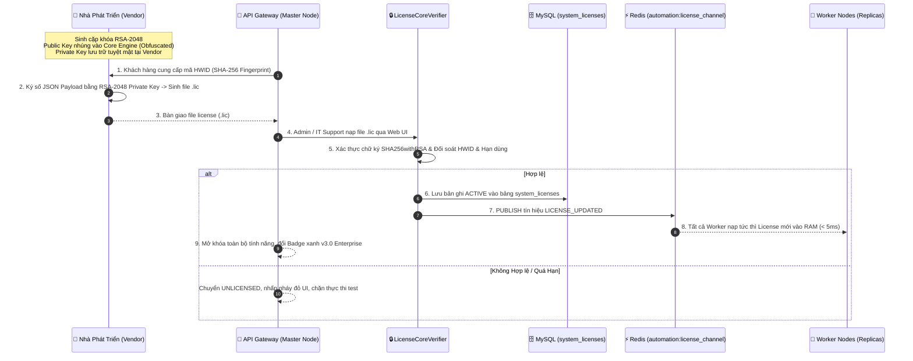
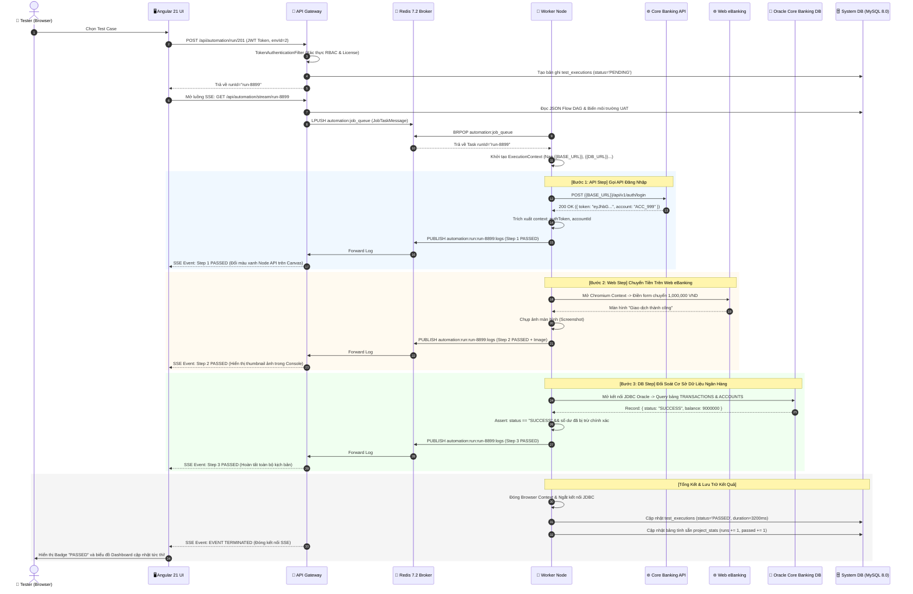

# 🏛️ TÀI LIỆU ĐẶC TẢ KIẾN TRÚC HỆ THỐNG TOÀN DIỆN (SYSTEM ARCHITECTURE SPECIFICATION)
# AUTOMATION UI BUILDER (FLOWBUILDER AUTOMATION PLATFORM)

> **Mã tài liệu**: `SYS-ARCH-FLOWBUILDER-2026-V3.0`  
> **Phiên bản kiến trúc**: `3.0 Enterprise Edition`  
> **Ngày cập nhật**: `09/09/2026`  
> **Trạng thái hệ thống**: Vận hành Production & Quy mô Big Data (Hỗ trợ 600,000+ Test Cases, Độ trễ < 100ms)  
> **Phạm vi áp dụng**: Toàn bộ hệ thống kiểm thử tự động phân tán đa nền tảng (Web UI, REST API, Database SUT, Mobile, Control Flow Logic)

---

## 📑 MỤC LỤC

1. [TỔNG QUAN HỆ THỐNG & NĂNG LỰC ĐÁP ỨNG (SYSTEM OVERVIEW & SLA CAPACITY)](#1-tổng-quan-hệ-thống--năng-lực-đáp-ứng-system-overview--sla-capacity)
2. [BẢNG TỔNG HỢP NGĂN XẾP CÔNG NGHỆ CHUẨN (TECHNOLOGY STACK BASELINE)](#2-bảng-tổng-hợp-ngăn-xếp-công-nghệ-chuẩn-technology-stack-baseline)
3. [SƠ ĐỒ KIẾN TRÚC TỔNG THỂ (SYSTEM ARCHITECTURE & DISTRIBUTED TOPOLOGY)](#3-sơ-đồ-kiến-trúc-tổng-thể-system-architecture--distributed-topology)
4. [CHI TIẾT CÁC TẦNG KIẾN TRÚC (ARCHITECTURAL LAYERS)](#4-chi-tiết-các-tầng-kiến-trúc-architectural-layers)
   - [4.1. Tầng Trình Diễn & Client (Angular 21 SPA & Chrome Extension)](#41-tầng-trình-diễn--client-angular-21-spa--chrome-extension)
   - [4.2. Bộ Đồng Bộ 3 Chiều & AST Flow Engine (Lossless Code-Graph Synchronization)](#42-bộ-đồng-bộ-3-chiều--ast-flow-engine-lossless-code-graph-synchronization)
   - [4.3. Tầng Điều Khiển & API Gateway (Spring Boot Control Plane)](#43-tầng-điều-khiển--api-gateway-spring-boot-control-plane)
   - [4.4. Tầng Hàng Đợi & Điều Phối Tác Vụ Phân Tán (Redis Message Bus & Scheduler)](#44-tầng-hàng-đợi--điều-phối-tác-vụ-phân-tán-redis-message-bus--scheduler)
   - [4.5. Tầng Động Cơ Thực Thi Đa Nền Tảng (Distributed Multi-Platform Worker Grid)](#45-tầng-động-cơ-thực-thi-đa-nền-tảng-distributed-multi-platform-worker-grid)
   - [4.6. Tầng Lưu Trữ & Cơ Sở Dữ Liệu Tối Ưu (Data Persistence & Pre-Aggregation)](#46-tầng-lưu-trữ--cơ-sở-dữ-liệu-tối-ưu-data-persistence--pre-aggregation)
5. [CƠ CHẾ QUẢN LÝ BIẾN ĐỘNG & NGỮ CẢNH (DYNAMIC VARIABLES & CONTEXT RESOLUTION)](#5-cơ-chế-quản-lý-biến-động--ngữ-cảnh-dynamic-variables--context-resolution)
6. [HỆ THỐNG DANH MỤC THAO TÁC (ACTION CATALOG SPECIFICATION)](#6-hệ-thống-danh-mục-thao-tác-action-catalog-specification)
7. [KIẾN TRÚC BẢN QUYỀN DOANH NGHIỆP & BẢO MẬT (ENTERPRISE LICENSING & ANTI-TAMPER)](#7-kiến-trúc-bản-quyền-doanh-nghiệp--bảo-mật-enterprise-licensing--anti-tamper)
8. [TRUYỀN PHÁT NHẬT KÝ THỜI GIAN THỰC (REAL-TIME SSE & WEBSOCKET LOGGING)](#8-truyền-phát-nhật-ký-thời-gian-thực-real-time-sse--websocket-logging)
9. [TRUNG TÂM PHÂN TÍCH & CHẨN ĐOÁN LỖI CHUẨN ALLURE (DASHBOARD & DIAGNOSTICS)](#9-trung-tâm-phân-tích--chẩn-đoán-lỗi-chuẩn-allure-dashboard--diagnostics)
10. [HÀNH TRÌNH THỰC THI LIÊN TUYẾN MẪU (END-TO-END EXECUTION TRACE)](#10-hành-trình-thực-thi-liên-tuyến-mẫu-end-to-end-execution-trace)
11. [QUY TRÌNH ĐÓNG GÓI, VẬN HÀNH & CI/CD (DEPLOYMENT & RELEASE GUIDE)](#11-quy-trình-đóng-gói-vận-hành--cicd-deployment--release-guide)

---

## 1. TỔNG QUAN HỆ THỐNG & NĂNG LỰC ĐÁP ỨNG (SYSTEM OVERVIEW & SLA CAPACITY)

**Automation UI Builder** *(FlowBuilder Automation Platform)* là nền tảng kiểm thử tự động hóa toàn diện chuẩn doanh nghiệp (All-in-One Enterprise Test Automation Platform). Hệ thống kết hợp đột phá giữa **Low-Code/No-Code Flowbuilder** (kéo thả sơ đồ trực quan), **Table Step Hierarchy** (danh sách bước phân cấp) và **TypeScript DSL Scripting** (can thiệp mã nguồn chuyên sâu), hỗ trợ kiểm thử liên tuyến: **Web UI (Playwright)**, **REST API**, **Database SQL (Core Banking / Enterprise DB)**, **Mobile (Appium)** và **JavaScript Sandbox Logic**.

```
┌────────────────────────────────────────────────────────────────────────────────────────┐
│                              CÁC CHỈ SỐ NĂNG LỰC VẬN HÀNH (SLA)                        │
├────────────────────────────────┬───────────────────────────────────────────────────────┤
│ Khối lượng kịch bản quản lý   │ Vận hành ổn định trên 600,000+ Test Cases & 30+ Dự án  │
│ Tốc độ phản hồi Dashboard Fast │ < 80ms (nhờ Pre-Aggregated Pattern & Native Queries)  │
│ Tìm kiếm kịch bản phân trang   │ < 20ms trên toàn bộ dữ liệu qua Composite Indexing    │
│ Độ trễ dừng khẩn cấp (Cancel) │ < 50ms qua Redis Pub/Sub Broadcast                     │
│ Đồng bộ License cụm phân tán  │ < 5ms qua kênh Redis Pub/Sub chuyên biệt               │
│ Tốc độ khởi động Browser Test  │ Giảm 80% thời gian qua Browser Context Pool           │
│ Kích thước Bundle Frontend     │ Initial Gzip Bundle ~95KB (Tailwind v4 JIT Purged)    │
└────────────────────────────────┴───────────────────────────────────────────────────────┘
```

---

## 2. BẢNG TỔNG HỢP NGĂN XẾP CÔNG NGHỆ CHUẨN (TECHNOLOGY STACK BASELINE)

Toàn bộ hệ thống được xây dựng trên nền tảng công nghệ đồng nhất và tối ưu cho môi trường doanh nghiệp:

| Phân Hệ / Thành Phần | Công Nghệ & Phiên Bản | Gói Thư Viện Chính & Cơ Chế Hoạt Động |
| :--- | :--- | :--- |
| **Frontend Framework** | **Angular 21** (`@angular/core: ^21.2.4`) | Kiến trúc Standalone Component, Signals Reactivity, `ChangeDetectionStrategy.OnPush`, Angular CDK (`@angular/cdk: ^21.2.2`). |
| **Giao Diện & Styling** | **Tailwind CSS v4** (`@tailwindcss/postcss: ^4.1.11`) | Động cơ JIT Compiler, chuẩn Design System Tailwind, hỗ trợ Dark/Light Theme thích ứng độ tương phản cao. |
| **Sơ Đồ Luồng (Canvas)**| **ng-diagram** (`^1.3.0`) + **Dagre** (`^0.8.5`) | Tự động bố cục đồ thị (Dagre Auto-Layout), Container Nodes tuỳ chỉnh (`IfElseGroup`, `WhileGroup`, `ForGroup`). |
| **Trình Soạn Thảo Mã** | **CodeMirror 6** (`@codemirror/*`) & Monaco | Highlight cú pháp TypeScript DSL, Auto-complete IntelliSense, One-Dark Theme, Linter & Formatter. |
| **Trực Quan Hóa Báo Cáo**| **ApexCharts** (`^5.3.2`) + **ng-apexcharts** | Biểu đồ xu hướng Pass/Fail 7/14/30 ngày, phân bổ chất lượng Platform, radar Flaky Tests. |
| **Tiện Ích Trình Duyệt** | **Chrome Extension (Manifest V3)** | Web Recorder Companion (TestCase Studio Edition) tự động trích xuất Selector đa tầng và đồng bộ tức thì về Canvas. |
| **Backend Core Plane** | **Spring Boot 2.7.18 LTS** / **Java 11 LTS** | Spring MVC REST APIs, Spring Security (JWT / RBAC), Spring Data JPA (Hibernate 5.6), Spring WebFlux, Spring WebSocket. |
| **Automation Engine** | **Microsoft Playwright for Java 1.40.0** | Điều khiển trình duyệt không đầu (Headless Chromium, Firefox, WebKit), Auto-wait, Browser Context Pool. |
| **Message Broker & Queue**| **Redis 7.2 Alpine** | Task Job Queue (`RPUSH`/`BRPOP`), Control Pub/Sub (`automation:control_channel`), License Sync (`automation:license_channel`). |
| **Cơ Sở Dữ Liệu Chính** | **MySQL 8.0 Enterprise** | InnoDB Buffer Pool 1GB, Composite Indexing, Partitioning hỗ trợ 600,000+ Test Cases. |
| **Bảo Mật & Bản Quyền** | **RSA-2048 + HWID SHA-256 + ProGuard** | Chữ ký số bất đối xứng `SHA256withRSA`, HWID Fingerprint, ProGuard 7.2.0 Bytecode Obfuscation, Anti-Tamper Guard. |
| **Container Hóa** | **Docker & Docker Compose** | 5 container chuẩn hóa: `automation-mysql`, `automation-redis`, `automation-gateway`, `automation-worker` (x2), `automation-frontend`. |

---

## 3. SƠ ĐỒ KIẾN TRÚC TỔNG THỂ (SYSTEM ARCHITECTURE & DISTRIBUTED TOPOLOGY)

Hệ thống được thiết kế theo mô hình **Master Control Plane - Distributed Multi-Worker Grid** hướng sự kiện (Event-Driven Architecture):

```mermaid
flowchart TB
    subgraph Client_Layer ["1. CLIENT & EXTENSION LAYER"]
        direction TB
        UI["🖥️ Angular 21 SPA (Tailwind CSS v4)\n• Flow Diagram Canvas (ng-diagram + Dagre)\n• Table Step View (CDK Drag-Drop Tree)\n• Script DSL Editor (CodeMirror 6 / Monaco)\n• Realtime Live Console & Allure Dashboard"]
        ChromeExt["🧩 Chrome Web Recorder Extension (Manifest V3)\n• Smart Multi-Locator Extraction (XPath, CSS, TestId)\n• Realtime Action Bridge to Canvas"]
    end

    subgraph Gateway_Layer ["2. API GATEWAY & CONTROL PLANE (Port: 9000)"]
        direction TB
        AuthFilter["🛡️ TokenAuthenticationFilter & RBAC\n(ADMIN, IT_SUPPORT, APPROVER, DEV, TESTER, VIEWER)"]
        REST_Hub["🌐 RESTful Controllers (18+ Controllers)\n(Projects, TestCases, Suites, Envs, AI, Licenses)"]
        AST_Engine["🧠 AST Flow Engine & Pre-Aggregator"]
        SSE_WS["⚡ Realtime Broadcaster (SSE & WebSocket /ws/live-log)"]
        LicenseVerifier["🔒 LicenseCoreVerifier (RSA-2048 & HWID Guard)"]
        TaskDispatcher["🚀 Fair-Share Task Dispatcher"]
    end

    subgraph Message_Bus ["3. DISTRIBUTED MESSAGE BROKER (Redis 7.2 Alpine)"]
        direction TB
        TaskQueue[("📥 Job Queue\n• automation:job_queue\n• automation:queue:tasks")]
        ControlChannel[("📡 Control Pub/Sub\n• automation:control_channel (Stop/Cancel <50ms)")]
        LicenseChannel[("🔑 License Pub/Sub\n• automation:license_channel (Cluster Sync <5ms)")]
        LogStreamPubSub[("📊 Live Log Pub/Sub\n• automation:run:{runId}:logs")]
    end

    subgraph Worker_Grid ["4. DISTRIBUTED WORKER EXECUTION GRID (Port: 8081 / Scaled N Nodes)"]
        direction TB
        Worker1["🐧 Worker Node #1\n(Playwright Pool + API/DB Runner)"]
        Worker2["🐧 Worker Node #2\n(Playwright Pool + API/DB Runner)"]
        WorkerN["🐧 Worker Node #N\n(Auto-scalable Instances)"]
    end

    subgraph Execution_Engines ["5. MULTI-PLATFORM EXECUTORS"]
        WebExec["🌐 Playwright Web Executor (Headless Chromium/Firefox)"]
        ApiExec["📡 WebFlux / Apache HTTP REST Executor"]
        DbExec["🗄️ Database JDBC Executor (Oracle / Postgres / MySQL SUT)"]
        MobileExec["📱 Appium Mobile Test Executor"]
        ScriptExec["⚙️ JavaScript Sandbox Executor (Context Injection)"]
    end

    subgraph Persistence_Layer ["6. ENTERPRISE DATA PERSISTENCE (MySQL 8.0)"]
        DB[("🗄️ MySQL 8.0 Database (automation_db)\n• Pre-Aggregated project_stats (<1ms Dashboard)\n• json_test_cases (Metadata) & details (JSON Steps)\n• test_executions, system_licenses, environments")]
    end

    %% Client Interactions
    UI -->|HTTPS / RESTful JSON| REST_Hub
    UI <-->|Server-Sent Events (SSE) & WebSocket| SSE_WS
    ChromeExt -.->|Bridge PostMessage / WebSocket| UI

    %% Gateway Internal
    REST_Hub --> AuthFilter
    AuthFilter --> LicenseVerifier
    REST_Hub --> AST_Engine
    REST_Hub --> TaskDispatcher
    REST_Hub -->|JPA Transactions & Fast Native Queries| DB
    LicenseVerifier -->|Validate & Load| DB

    %% Gateway to Redis
    TaskDispatcher -->|LPUSH JobTaskMessage| TaskQueue
    REST_Hub -->|PUBLISH Cancel Signal| ControlChannel
    LicenseVerifier -->|PUBLISH License Update| LicenseChannel
    LogStreamPubSub -->|Subscribe & Stream| SSE_WS

    %% Worker Interactions
    Worker1 & Worker2 & WorkerN -->|BRPOP / Safe Task Pull| TaskQueue
    Worker1 & Worker2 & WorkerN -.->|Listen Stop Signals| ControlChannel
    Worker1 & Worker2 & WorkerN -.->|Listen License Sync| LicenseChannel
    Worker1 & Worker2 & WorkerN --> Execution_Engines
    Execution_Engines -->|PUBLISH Realtime Step Logs| LogStreamPubSub
    Worker1 & Worker2 & WorkerN -->|Batch Update Execution Results| DB
```

---

## 4. CHI TIẾT CÁC TẦNG KIẾN TRÚC (ARCHITECTURAL LAYERS)

### 4.1. Tầng Trình Diễn & Client (Angular 21 SPA & Chrome Extension)

#### A. Single Page Application (Angular 21 + Tailwind CSS v4)
- **Kiến trúc Standalone & Signals**: Sử dụng các thành phần độc lập (Standalone Components) kết hợp Signals và `ChangeDetectionStrategy.OnPush`, triệt tiêu hoàn toàn hiện tượng lag/đơ giao diện (Zero UI Freeze).
- **Trải nghiệm Dark/Light Theme**: Hỗ trợ chuyển đổi giao diện sáng/tối tức thì với token màu sắc tối ưu độ tương phản, ApexCharts tương thích 100% trên cả 2 nền.
- **Phân chia Router Guards chặt chẽ**:
  - `authGuard`: Bảo vệ toàn bộ layout chính và các tuyến đường làm việc (`/projects`, `/test-cases`, `/test-suite`). Nếu chưa xác thực $\rightarrow$ Điều hướng về `/signin?returnUrl=...`.
  - `guestGuard`: Chặn người dùng đã có session truy cập lại trang đăng nhập/đăng ký $\rightarrow$ Tự động chuyển về `/projects`.
  - `roleGuard`: Kiểm tra thẩm quyền truy cập các tính năng nâng cao (`/system/licenses`, `/system/users`).
  - `authInterceptor`: Tự động đính kèm `Authorization: Bearer <JWT>` và bắt lỗi HTTP `401` để thu hồi phiên.

#### B. Tiện Ích Ghi Thao Tác Trình Duyệt (Chrome Web Recorder Extension - Manifest V3)
- **Tên tiện ích**: FlowBuilder Web Recorder (TestCase Studio Edition).
- **Cấu trúc Module**:
  - `background.js`: Quản lý vòng đời ghi hình, điều phối kết nối giữa tab mục tiêu và giao diện FlowBuilder.
  - `recorder.js`: Inject trực tiếp vào DOM trang web đích, lắng nghe các sự kiện `click`, `input`, `change`, `keydown`, `hover` và tự động trích xuất bộ nhận diện phần tử (Locators) theo thứ tự ưu tiên: `id` $\rightarrow$ `data-testid` $\rightarrow$ `name` $\rightarrow$ `CSS Selector` $\rightarrow$ `Robust XPath`.
  - `bridge.js` & `popup.html`: Giao tiếp 2 chiều với TestCase Editor, đẩy trực tiếp danh sách bước thu được vào sơ đồ Canvas.

---

### 4.2. Bộ Đồng Bộ 3 Chiều & AST Flow Engine (Lossless Code-Graph Synchronization)

Trung tâm điều phối kịch bản của Frontend là **`AstFlowEngineService`**, đảm bảo việc chỉnh sửa kịch bản trên bất kỳ giao diện nào cũng được đồng bộ tức thì sang 2 giao diện còn lại mà **không bị mất mát cấu trúc hay tham số (Lossless 3-Way Sync)**:

```
                          ┌──────────────────────────────────────────────┐
                          │         1. DIAGRAM VISUAL CANVAS             │
                          │   (Kéo thả Node, Bố cục Dagre, Containers)   │
                          └──────────────────────┬───────────────────────┘
                                                 ▲
                                                 │ astToGraph() / graphToCode()
                                                 ▼
┌──────────────────────────────────────┐  Lossless 2-Way  ┌──────────────────────────────────────┐
│        2. TABLE STEP HIERARCHY       │ ◄──────────────► │       3. TYPESCRIPT SCRIPT DSL       │
│ (Cây phân cấp, CDK Reorder, Indent)  │    AST Engine    │   (Monaco/CodeMirror, IntelliSense)  │
└──────────────────────────────────────┘                  └──────────────────────────────────────┘
```

#### Các Khối Lệnh Cấu Trúc Chuyên Biệt (Control Flow Containers):
1. **`IfElseGroupComponent` (Khối Điều Kiện Rẽ Nhánh)**:
   - Kích thước tiêu chuẩn `680 x 280 px` với 2 làn xử lý trực quan:
     - **Làn trái (Emerald)**: Nhánh `True (Nếu Đúng)` $\rightarrow$ Chứa các bước có `branch: 'true'`.
     - **Làn phải (Rose)**: Nhánh `Else (Nếu Sai)` $\rightarrow$ Chứa các bước có `branch: 'false'`.
   - Kết nối: 1 Cổng Input bên trái và 1 Cổng Output bên phải. Header tích hợp nút mở Drawer cấu hình biểu thức logic (`conditionExpression`).
2. **`WhileGroupComponent` (Vòng Lặp Điều Kiện / Polling)**:
   - Kích thước `550 x 280 px`, chuyên dụng cho polling đối soát giao dịch ngân hàng kèm `maxIterations` và `delayMs`.
3. **`ForGroupComponent` (Vòng Lặp Đếm Số Lần)**:
   - Kích thước `550 x 280 px`, lặp lại danh sách bước bên trong theo số lượt cấu hình `loopCount`.

---

### 4.3. Tầng Điều Khiển & API Gateway (Spring Boot Control Plane)

API Gateway vận hành trên nền **Spring Boot 2.7.18 LTS / Java 11 LTS** tại cổng `9000`, chịu trách nhiệm:
- **18+ REST Controllers**:
  - `AuthController`: Đăng nhập, đăng ký, cấp phát và thu hồi JWT Token.
  - `ProjectController`: Quản lý dự án, không gian làm việc (Workspace), phân quyền thành viên theo dự án.
  - `TestCaseController`: Quản lý thông tin metadata và cấu trúc chi tiết JSON Flow DAG.
  - `SuiteController`: Quản lý bộ kịch bản kiểm thử (Test Suites) và điều phối chạy theo lịch.
  - `EnvironmentController`: Quản lý biến môi trường theo từng dự án (`DEV`, `UAT`, `STAGING`, `PROD`).
  - `DashboardController`: Cung cấp API nạp lũy tiến (Summary, Trend, Diagnostics) cho Dashboard.
  - `AutomationController`: Tiếp nhận lệnh chạy (`POST /api/automation/run/{id}`), dừng (`POST /api/automation/stop/{runId}`) và stream log (`GET /api/automation/stream/{runId}`).
  - `LicenseController`: Quản lý nạp file bản quyền `.lic`, xác thực HWID, kích hoạt/vô hiệu hóa license.
  - `AiController` & `AiKeyController`: Quản lý API Key và trợ lý AI sinh kịch bản tự động.
  - `GlobalFunctionController`: Quản lý các hàm JavaScript dùng chung trong dự án.
  - `HookSettingController`: Cấu hình vòng đời kiểm thử (`BEFORE_ALL`, `AFTER_ALL`, `ON_FAILURE`).
  - `TestCaseCommentController`: Quản lý thảo luận, bình luận và phản hồi trên từng kịch bản.
  - `SystemLoadTestController`: Sinh dữ liệu tải giả lập kiểm thử năng lực hệ thống (lên tới 600,000+ tests).
  - `UserController`: Quản trị người dùng, đồng bộ LDAP, đổi mật khẩu.
- **Transaction & Connection Pooling**: Quản lý kết nối qua HikariCP (Max 50 / Min 15 connections), tối ưu hóa Transaction và Batching.

---

### 4.4. Tầng Hàng Đợi & Điều Phối Tác Vụ Phân Tán (Redis Message Bus & Scheduler)

Sử dụng **Redis 7.2** làm hạ tầng truyền tin tốc độ cao (In-Memory Message Broker):
1. **Hàng đợi công việc (`automation:job_queue`)**:
   - Gateway đẩy gói tin thực thi (`JobTaskMessage`) qua lệnh `LPUSH`.
   - Các Worker tranh nhận việc theo cơ chế `BRPOP` đảm bảo mỗi tác vụ chỉ được đúng 1 Worker xử lý (Competing Consumers Pattern).
2. **Kênh điều khiển dừng khẩn cấp (`automation:control_channel`)**:
   - Khi người dùng ấn nút **Stop/Cancel** trên UI, Gateway phát thông điệp `STOP_RUN:<runId>` qua Redis Pub/Sub.
   - Tất cả Worker đang chạy tác vụ sẽ ngắt tiến trình Playwright và đóng kết nối ngay trong **< 50ms**.
3. **Kênh đồng bộ bản quyền (`automation:license_channel`)**:
   - Khi có thay đổi về License, Gateway phát tín hiệu `LICENSE_UPDATED`.
   - Toàn bộ Worker trong cụm nạp lại trạng thái bản quyền mới vào RAM trong **< 5ms**.
4. **Kênh truyền phát nhật ký thời gian thực (`automation:run:{runId}:logs`)**:
   - Worker bắn log từng bước vào Topic Redis. Gateway chuyển tiếp tức thì về trình duyệt người dùng qua SSE Emitter.

---

### 4.5. Tầng Động Cơ Thực Thi Đa Nền Tảng (Distributed Multi-Platform Worker Grid)

Các Worker chạy độc lập (khởi chạy với biến môi trường `APP_ROLE=WORKER`, cổng `8081` nội bộ), hỗ trợ co giãn động theo nhu cầu (`scale=N`):
- **Browser Context Pooling**: Tái sử dụng phiên trình duyệt Playwright Headless đã khởi tạo sẵn, giúp giảm 80% thời gian overhead so với việc mở mới trình duyệt cho từng test case.
- **Bộ 5 Động Cơ Thực Thi Chuyên Biệt**:
  1. `WebTestExecutor`: Điều khiển Playwright Engine (Click, Fill, Hover, Scroll, Wait, Screenshot, Assert Element).
  2. `ApiTestExecutor`: Thực hiện HTTP Request (GET, POST, PUT, DELETE, PATCH), hỗ trợ Headers, Auth, Multipart, JsonPath Extractions.
  3. `DatabaseTestExecutor`: Mở kết nối JDBC tới cơ sở dữ liệu của ứng dụng được kiểm thử (Oracle Thin, Postgres, MySQL, SQL Server) để truy vấn và kiểm tra tính toàn vẹn dữ liệu.
  4. `MobileTestExecutor`: Giao tiếp với Appium Server để điều khiển ứng dụng Android/iOS.
  5. `ControlFlowExecutor` & `ScriptExecutor`: Điều khiển rẽ nhánh logic và hộp cát JavaScript Sandbox can thiệp trực tiếp vào DOM.

---

### 4.6. Tầng Lưu Trữ & Cơ Sở Dữ Liệu Tối Ưu (Data Persistence & Pre-Aggregation)

Hệ thống sử dụng **MySQL 8.0** với các bảng thực thể JPA được thiết kế tối ưu cho khối lượng dữ liệu khổng lồ:

```
┌────────────────────────────────────────────────────────────────────────────────────────┐
│                              DANH MỤC CƠ SỞ DỮ LIỆU CHÍNH                              │
├──────────────────────────┬─────────────────────────────────────────────────────────────┤
│ 1. projects              │ Lưu trữ thông tin dự án, mã dự án, mô tả, ngày cập nhật.   │
│ 2. project_stats         │ BẢNG TÍNH SẴN: Lưu total_test_cases, runs, passed, failed.  │
│ 3. json_test_cases       │ Lưu metadata kịch bản nhẹ (id, project_id, name, status).   │
│ 4. json_test_case_detail │ Lưu toàn bộ cấu trúc JSON Flow Canvas (steps, edges, hooks).│
│ 5. test_suites           │ Lưu thông tin nhóm kịch bản và danh sách ID test case.      │
│ 6. project_environments  │ Lưu các môi trường thực thi (DEV, UAT, STAGING, PROD).      │
│ 7. environment_variables │ Lưu cặp key-value biến môi trường đã được mã hóa AES.       │
│ 8. test_executions       │ Lưu lịch sử thực thi, thời lượng, kết quả và step logs.     │
│ 9. system_licenses       │ Lưu giấy phép bản quyền RSA-2048, HWID, quotas và expiry.    │
│ 10. users & roles        │ Quản lý tài khoản, mã băm mật khẩu BCrypt, vai trò RBAC.    │
│ 11. project_users        │ Bảng quan hệ N:M phân quyền thành viên theo từng dự án.     │
│ 12. test_case_comments   │ Lưu trữ thảo luận, trao đổi xét duyệt trên kịch bản.       │
│ 13. global_functions     │ Lưu trữ các hàm JavaScript tái sử dụng cấp dự án.           │
│ 14. hook_settings        │ Cấu hình kịch bản tiền/hậu kiểm (Lifecycle Hooks).           │
│ 15. ai_keys & sessions   │ Quản lý API Key AI và lịch sử hội thoại sinh kịch bản.      │
└──────────────────────────┴─────────────────────────────────────────────────────────────┘
```

#### Kỹ Thuật Tối Ưu Hóa Dữ Liệu 600,000+ Records:
1. **Mô hình Bảng Tính Sẵn (Pre-Aggregated Pattern)**: Bảng `project_stats` lưu trữ sẵn các chỉ số thống kê. Khi có sự kiện tạo test hoặc chạy test xong, hệ thống chỉ cập nhật 1 dòng trong `project_stats`. Truy vấn Dashboard đọc trực tiếp dòng này trong **< 0.5ms**, loại bỏ hoàn toàn các câu lệnh `COUNT(*)` đắt đỏ.
2. **Tách Rời Metadata & Detail JSON**: Bảng `json_test_cases` chỉ lưu thông tin nhẹ để phân trang siêu nhanh; bảng `json_test_case_detail` chứa cấu trúc JSON nặng chỉ được nạp khi người dùng mở đúng kịch bản đó.
3. **Composite Indexing**: Đánh chỉ mục tổng hợp trên các trường hay lọc: `(project_id, status)`, `(project_id, created_at)`, `(project_id, last_run_at)`.

---

## 5. CƠ CHẾ QUẢN LÝ BIẾN ĐỘNG & NGỮ CẢNH (DYNAMIC VARIABLES & CONTEXT RESOLUTION)

Khi thực thi kịch bản, hệ thống giải quyết và thay thế các biến động (`{{variable_name}}` hoặc `{VARIABLE_NAME}`) theo thứ tự ưu tiên 4 cấp từ cao xuống thấp:

```
┌────────────────────────────────────────────────────────────────────────────────────────┐
│                        THỨ TỰ ƯU TIÊN PHÂN GIẢI BIẾN (VARIABLE PRECEDENCE)             │
├────────────────────────────────────────────────────────────────────────────────────────┤
│ 🥇 MỨC 1 (Cao nhất) : Step Extractions & Runtime Context (Sinh ra từ các bước trước)  │
│                      Ví dụ: {{authToken}}, {{response_orderId}}, {{extracted_value}}   │
├────────────────────────────────────────────────────────────────────────────────────────┤
│ 🥈 MỨC 2            : Hook Variables & Pre-run Script Output (Từ kịch bản tiền kiểm)   │
│                      Ví dụ: {{pre_session_id}}, {{temp_test_user}}                     │
├────────────────────────────────────────────────────────────────────────────────────────┤
│ 🥉 MỨC 3            : Environment Variables (Biến cấu hình theo môi trường DEV/UAT)    │
│                      Ví dụ: {{BASE_URL}}, {{DB_HOST}}, {{API_KEY}}                     │
├────────────────────────────────────────────────────────────────────────────────────────┤
│ 🏅 MỨC 4 (Thấp nhất): Built-in Global Functions & System Generators                    │
│                      Ví dụ: {{$timestamp}}, {{$uuid}}, {{$randomPhone}}, {{$randomStr}}│
└────────────────────────────────────────────────────────────────────────────────────────┘
```

---

## 6. HỆ THỐNG DANH MỤC THAO TÁC (ACTION CATALOG SPECIFICATION)

Hệ thống cung cấp hơn 50+ từ khóa kiểm thử chuẩn hóa với đầy đủ schema tham số:

### 6.1. Nhóm Web UI Automation (Playwright Engine)
| Keyword | Tên Thao Tác | Tham Số Chính |
| :--- | :--- | :--- |
| `OPEN_URL` | Mở trang web đích | `url` |
| `CLICK` | Nhấp chuột trái | `locatorValue`, `selector`, `locatorType` |
| `DOUBLE_CLICK` | Nhấp đúp chuột | `locatorValue`, `selector`, `locatorType` |
| `RIGHT_CLICK` | Nhấp chuột phải | `locatorValue`, `selector`, `locatorType` |
| `HOVER` | Rê chuột vào phần tử | `locatorValue`, `selector`, `locatorType` |
| `INPUT_TEXT` | Nhập văn bản vào ô input | `locatorValue`, `selector`, `testData`, `value` |
| `CLEAR_TEXT` | Xóa sạch văn bản trong ô input | `locatorValue`, `selector`, `locatorType` |
| `PRESS_KEY` | Nhấn phím bàn phím | `key` (`Enter`, `Tab`, `Escape`...) |
| `SCROLL_TO` | Cuộn trang tới phần tử | `locatorValue`, `selector`, `locatorType` |
| `DRAG_AND_DROP`| Kéo và thả phần tử | `sourceLocator`, `targetLocator` |
| `ASSERT_VISIBLE`| Kiểm tra phần tử có hiển thị | `locatorValue`, `selector`, `timeout` |
| `ASSERT_TEXT` | Kiểm tra nội dung văn bản | `locatorValue`, `selector`, `expectedText` |
| `ASSERT_VALUE` | Kiểm tra giá trị thuộc tính value | `locatorValue`, `selector`, `expectedValue` |
| `WAIT_FOR_ELEMENT`| Chờ phần tử xuất hiện trong DOM | `locatorValue`, `selector`, `timeout` |
| `TAKE_SCREENSHOT`| Chụp ảnh màn hình lưu vết | `screenshotName`, `value` |
| `WAIT_TIME` | Tạm dừng luồng thực thi | `timeout` (mili-giây) |

### 6.2. Nhóm REST API Testing
| Keyword | Tên Thao Tác | Tham Số Chính |
| :--- | :--- | :--- |
| `HTTP_GET` | Gửi yêu cầu HTTP GET | `endpoint`, `url`, `headers`, `params` |
| `SEND_REQUEST` | Gửi HTTP POST / PUT / DELETE / PATCH | `method`, `endpoint`, `url`, `body`, `headers` |
| `ASSERT_STATUS` | Kiểm tra mã phản hồi HTTP | `expectedStatus` (`200`, `201`, `400`...) |
| `EXTRACT_RESPONSE`| Trích xuất dữ liệu từ JSON Response | `jsonPath` (VD: `$.data.token`), `variableName` |

### 6.3. Nhóm Database SUT (SQL Engine)
| Keyword | Tên Thao Tác | Tham Số Chính |
| :--- | :--- | :--- |
| `EXECUTE_QUERY` | Thực thi câu lệnh SQL (SELECT / UPDATE)| `sqlQuery`, `query`, `targetDb` |
| `ASSERT_ROW_COUNT`| Kiểm tra số lượng bản ghi trả về | `expectedRowCount`, `operator` |

### 6.4. Nhóm Logic, Điều Khiển & Mở Rộng
| Keyword | Tên Thao Tác | Tham Số Chính |
| :--- | :--- | :--- |
| `IF_CONDITION` | Rẽ nhánh điều kiện (True / Else) | `conditionExpression` |
| `WHILE_LOOP` | Vòng lặp điều kiện / Polling trạng thái| `conditionExpression`, `maxIterations`, `delayMs` |
| `FOR_LOOP` | Vòng lặp đếm theo số lần | `loopCount`, `iteratorVariable` |
| `CALL_SUB_TESTCASE`| Gọi kịch bản con dùng chung (Common Test)| `subTestCaseId`, `inputParams` |
| `EXECUTE_CODE` | Thực thi mã JavaScript tùy chỉnh trong Sandbox| `script`, `codeLanguage` |

---

## 7. KIẾN TRÚC BẢN QUYỀN DOANH NGHIỆP & BẢO MẬT (ENTERPRISE LICENSING & ANTI-TAMPER)

Hệ thống FlowBuilder tích hợp kiến trúc bảo vệ bản quyền đa tầng và chống can thiệp ngược đạt tiêu chuẩn ngân hàng:



### Các Trụ Cột Bảo Mật Chính:
1. **Xác thực Mật mã Bất đối xứng RSA-2048**: File `.lic` chứa JSON định danh khách hàng, hạn ngạch (Max Workers, Max Projects, Max Test Cases) và chữ ký số RSA-2048. Không thể làm giả nếu không có Private Key của Vendor.
2. **Khóa Phần Cứng (Hardware Fingerprint / HWID)**: Chuỗi băm SHA-256 từ CPU, MAC Address, Machine ID. Trong cụm Docker, các container chia sẻ biến môi trường `SERVER_HWID`.
3. **Phân Quyền RBAC Quản Trị Bản Quyền**:
   - `ADMIN`: Nạp license mới qua Web UI.
   - `IT_SUPPORT`: Cổng quản trị chuyên biệt (`/system/licenses`), kích hoạt/vô hiệu hóa license, đồng bộ tài khoản người dùng. Không bị chặn bởi popup bản quyền.
   - `TESTER` / `DEVELOPER` / `VIEWER`: Xem trạng thái bản quyền; nếu hết hạn sẽ bị chặn chạy test.
4. **Làm Rối Mã Nguồn (ProGuard Obfuscation)**: Maven ProGuard Plugin tự động làm rối toàn bộ package `com.bank.automation.core.security.**` khi build container.
5. **Cơ Chế Chống Debug & Can Thiệp Ngược**: `MonotonicTimeGuard` và `AstPoisonEngine` phát hiện thao tác tua lùi thời gian hệ thống hoặc can thiệp bộ nhớ bytecode.

---

## 8. TRUYỀN PHÁT NHẬT KÝ THỜI GIAN THỰC (REAL-TIME SSE & WEBSOCKET LOGGING)

Hệ thống hỗ trợ 2 kênh truyền phát log tiến độ chạy kịch bản mượt mà, không gây quá tải mạng:

```
[Worker Grid Node] 
       │ (Phát sinh Log, Kết quả Step, Ảnh Screenshot)
       ▼
[Redis Publisher] ──────────► Kênh: `automation:run:{runId}:logs`
                                     │
                                     ▼
[Gateway Redis Subscriber] ──► Nhận message từ Redis
       │
       ├─────────────────────────────────┬─────────────────────────────────┐
       ▼                                 ▼                                 ▼
[Server-Sent Events (SSE)]      [WebSocket (/ws/live-log)]      [MySQL Batch Ingestion]
GET /api/automation/stream/{id}  STOMP / SockJS Protocol         Ghi test_executions
       │                                 │
       └────────────────┬────────────────┘
                        ▼
            [Trình Duyệt Angular SPA]
            • Đổi màu Node Canvas thời gian thực (Xanh/Đỏ/Vàng)
            • Hiển thị Execution Terminal & Ảnh Screenshot Lightbox
```

---

## 9. TRUNG TÂM PHÂN TÍCH & CHẨN ĐOÁN LỖI CHUẨN ALLURE (DASHBOARD & DIAGNOSTICS)

Phân hệ Dashboard cung cấp báo cáo phân tích chất lượng chuyên sâu:

```
┌────────────────────────────────────────────────────────────────────────────────────────┐
│                          KIẾN TRÚC BÁO CÁO & CHẨN ĐOÁN ALLURE                          │
├────────────────────────────────────────────────────────────────────────────────────────┤
│ 1. 4 Thẻ KPI Tổng Quan : Tổng Test Cases, Tỷ lệ Pass Rate %, Lượt chạy, Thời lượng TB  │
│ 2. Test Trend Chart    : Diễn biến Passed / Failed / Broken / Skipped (7, 14, 30 ngày) │
│ 3. Platform Breakdown  : Biểu đồ chất lượng Web UI, REST API, Mobile, Database SUT    │
│ 4. Defect Categorization:                                                              │
│    • Product Defects   : Lỗi nghiệp vụ (Assertion Failed, Status Code != 200)          │
│    • Test Defects      : Lỗi kịch bản (Selector sai, Element Timeout, Script Syntax)   │
│    • System / Broken   : Lỗi hạ tầng (Connection refused, Database Down, Network Drop) │
│ 5. Top Insights Radar  : Top 10 Kịch bản Lỗi nhiều nhất, Chạy chậm nhất, Flaky Radar  │
│ 6. Tiện ích Xuất Bản   : Nút Live Refresh tức thì & Xuất ảnh báo cáo PNG chất lượng cao│
└────────────────────────────────────────────────────────────────────────────────────────┘
```

---

## 10. HÀNH TRÌNH THỰC THI LIÊN TUYẾN MẪU (END-TO-END EXECUTION TRACE)

Hành trình chi tiết của 1 lượt chạy kịch bản liên tuyến: **Đăng nhập REST API ➔ Chuyển tiền Web Banking ➔ Đối soát Số dư Database Core Banking**:



---

## 11. QUY TRÌNH ĐÓNG GÓI, VẬN HÀNH & CI/CD (DEPLOYMENT & RELEASE GUIDE)

### 11.1. Cấu Hình Docker Compose Chuẩn

Hệ thống được container hóa hoàn chỉnh qua file `docker-compose.yml`:

```yaml
services:
  mysql:
    image: mysql:8.0
    container_name: automation-mysql
    restart: always
    ports: ["3306:3306"]
    environment:
      TZ: Asia/Ho_Chi_Minh
      MYSQL_DATABASE: automation_db
      MYSQL_USER: app_user
      MYSQL_PASSWORD: app_password_123
    command: >
      --max_connections=500
      --innodb_buffer_pool_size=1G
      --innodb_read_io_threads=8
      --innodb_write_io_threads=8

  redis:
    image: redis:7.2-alpine
    container_name: automation-redis
    restart: always
    ports: ["6379:6379"]

  automation-gateway:
    build: { context: ./Backend, dockerfile: Dockerfile }
    container_name: automation-gateway
    restart: always
    ports: ["9000:9000"]
    environment:
      APP_ROLE: GATEWAY
      SERVER_PORT: 9000
      SPRING_DATASOURCE_URL: jdbc:mysql://mysql:3306/automation_db?useSSL=false&serverTimezone=Asia/Ho_Chi_Minh
      SPRING_REDIS_HOST: redis
      SPRING_REDIS_PORT: 6379
      JAVA_OPTS: "-Xms1024m -Xmx2048m -XX:+UseG1GC"

  automation-frontend:
    build: { context: ./Frontend, dockerfile: Dockerfile }
    container_name: automation-frontend
    restart: always
    ports: ["4200:80", "80:80"]

  automation-worker:
    build: { context: ./Backend, dockerfile: Dockerfile }
    restart: always
    scale: 2
    environment:
      APP_ROLE: WORKER
      SERVER_PORT: 8081
      SPRING_DATASOURCE_URL: jdbc:mysql://mysql:3306/automation_db?useSSL=false&serverTimezone=Asia/Ho_Chi_Minh
      SPRING_REDIS_HOST: redis
      SPRING_REDIS_PORT: 6379
      PLAYWRIGHT_HEADLESS: "true"
```

### 11.2. Các Lệnh Vận Hành Nhanh

```bash
# 1. Khởi động toàn bộ cụm dịch vụ
docker compose up -d

# 2. Tăng quy mô Worker lên 4 hoặc 8 instances khi cần chạy tải lớn
docker compose up -d --scale automation-worker=4

# 3. Kiểm tra trạng thái toàn bộ containers
docker compose ps

# 4. Xem nhật ký thời gian thực của Gateway hoặc Worker
docker logs -f automation-gateway
docker logs -f automationui-automation-worker-1

# 5. Đóng gói sản phẩm chuyển giao cho khách hàng (1-Click Build)
./1_CLICK_BUILD_RELEASE_FOR_CLIENT.bat

# 6. Phát hành giấy phép bản quyền cho khách hàng (1-Click License)
./1_CLICK_ISSUE_LICENSE.bat
```

### 11.3. Cổng & Địa Chỉ Truy Cập Dịch Vụ
- **Giao diện Web Flowbuilder**: [http://localhost:4200](http://localhost:4200) hoặc [http://localhost](http://localhost)
- **Backend API Gateway**: [http://localhost:9000](http://localhost:9000)
- **MySQL Database**: `localhost:3306` (User: `app_user` / `app_password_123`)
- **Redis Message Broker**: `localhost:6379`
- **Tiện ích Chrome Extension**: Thư mục `./chrome-extension` (Tải qua `chrome://extensions` chế độ Developer)
